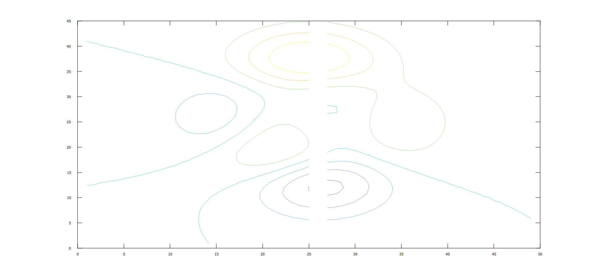

# contour

Contour plot of matrix

## Syntax

- contour(Z)
- contour(X, Y, Z)
- contour(..., levels)
- contour(..., LineSpec)
- contour(ax, ...)
- M = contour(...)
- [M, h] = contour(...)

## Input argument

- X - x-coordinates: vector or matrix.
- Y - y-coordinates: vector or matrix.
- Z - z-coordinates: vector or matrix.
- levels - Contour levels: scalar or vector.
- LineSpec - Line style and color
- ax - a scalar graphics object value: parent container, specified as a axes.

## Output argument

- M - Contour matrix.
- h - a graphics object: contour type.

## Description

  <p><b>contour(Z)</b> generates a contour plot representing isolines of the matrix Z. Each isoline corresponds to a specific height value on the x-y plane.</p>
  <p>Nelson automatically selects the contour lines to display based on the values in Z. The column and row indices of Z serve as the x and y coordinates in the plane, respectively.</p>
  <p><b>contour(X, Y, Z)</b> allows the user to specify the x and y coordinates corresponding to the values in matrix Z. This enables more precise control over the positioning of the contour plot on the x-y plane.</p>
  <p>The matrices X and Y provide the coordinates, while Z contains the height values for generating the contour plot.</p>
  <p>Property Name-Value Pairs:</p>
  <p/>
  <p><b>LevelList</b>: The contour levels, specified as a vector of z values, determine the height levels at which the contour lines are drawn. By default, when not explicitly provided, the contour function automatically selects these values to cover the range of values present in the ZData property, ensuring comprehensive coverage of the data range. Default: empty matrix.</p>
  <p><b>LevelListMode</b>: Selection mode for LevelList: 'manual' or 'auto' (default).</p>
  <p><b>LevelStep</b>: Spacing between contour lines: scalar numeric value or 0 (default).</p>
  <p><b>LevelStepMode</b>:Selection mode for LevelStep: 'manual' or 'auto' (default).</p>
  <p><b>EdgeColor</b>: Color of contour lines: rgb color or 'flat' (default).</p>
  <p><b>EdgeAlpha</b>: Contour line transparency: scalar in range [0, 1] or 1 (default).</p>
  <p><b>LineStyle</b>: Line style: '--', ':',  '-.' or '-' (default).</p>
  <p><b>LineWidth</b>: Line Width: positive value or  0.5 (default).</p>
  <p><b>ContourMatrix</b>: contour matrix.</p>
  <p><b>XData</b>: x values: vector or matrix or [] (default).</p>
  <p><b>YData</b>: y values: vector or matrix or [] (default).</p>
  <p><b>ZData</b>: z values: vector or matrix or [] (default).</p>
  <p><b>XDataMode</b>: Selection mode for XData: 'manual' or 'auto' (default).</p>
  <p><b>YDataMode</b>: Selection mode for YData: 'manual' or 'auto' (default).</p>
  <p><b>DisplayName</b>: Legend label: character vector, string scalar or '' (default).</p>
  <p><b>Visible</b>: State of visibility: on/off logical value, 'on' (default).</p>
  <p><b>Parent</b>: Parent: Axes object or Group object.</p>
  <p><b>Children</b>: Children.</p>
  <p><b>HandleVisibility</b>: Visibility of handle 'on', 'off'.</p>
  <p><b>Type</b>: Type of graphics object 'contour'.</p>
  <p><b>Tag</b>: Object identifier: character vector, string scalar or '' (default).</p>
  <p><b>UserData</b>: User data: array or  [] (default).</p>
  <p><b>CreateFcn</b>Callback (function handle, string or cell) called when object is created.
Set this property on an existing component has no effect.</p>
  <p><b>DeleteFcn</b>Callback (function handle, string or cell) called when object is deleted.</p>
  <p><b>BeingDeleted</b> Flag indicating that the object is being deleted.</p>

## Examples

```matlab
f = figure();
subplot(2, 3, 1)
x = linspace(-2 * pi, 2 * pi);
y = linspace(0, 4 * pi);
[X, Y] = meshgrid(x, y);
Z = sin(X) + cos(Y);
contour(X, Y, Z);

subplot(2, 3, 2)
[X, Y, Z] = peaks;
contour(X, Y, Z, 20)

subplot(2, 3, 3)
[X, Y, Z] = peaks;
v = [1,1];
contour(X, Y, Z, v)

subplot(2, 3, 4)
[X, Y, Z] = peaks;
contour(X, Y, Z, '-.')

subplot(2, 3, 5)
Z = peaks;
[M, c] = contour(Z);
c.LineWidth = 3;

subplot(2, 3, 6)
[theta, r] = meshgrid (linspace (0,2*pi,64), linspace (0,1,64));
[X, Y] = pol2cart (theta, r);
Z = sin (2*theta) .* (1-r);
contour (X, Y, abs (Z), 10);
```


```matlab
rng('default');
f = figure();
N = 50;
contour(1:N, 1:N, rand(N), 5)
```


```matlab
f = figure();
Z = peaks;
Z(:,26) = NaN;
contour(Z)
```



## See also

[contour3](contour3.md), [surf](surf.md), [mesh](mesh.md).

## History

| Version | Description                          |
| ------- | ------------------------------------ |
| 1.3.0   | initial version                      |
| 1.7.0   | CreateFcn, DeleteFcn callback added. |
| --      | BeingDeleted property added.         |

## Author

Allan CORNET
