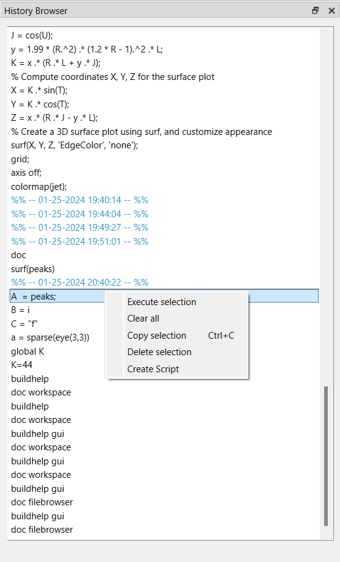

# commandhistory

Command History

## Syntax

- commandhistory

## Description

  
The Command History window presents a record of statements executed in both the current and past Nelson sessions.

  
Each session is timestamped with the short date format of your operating system, followed by the corresponding statements.

  
 Entries within the Command History window can be selected for various actions and operations.

  

    
  

## See also

[workspace](workspace.md), [filebrowser](filebrowser.md).

## History

| Version | Description     |
| ------- | --------------- |
| 1.1.0   | initial version |

## Author

Allan CORNET
