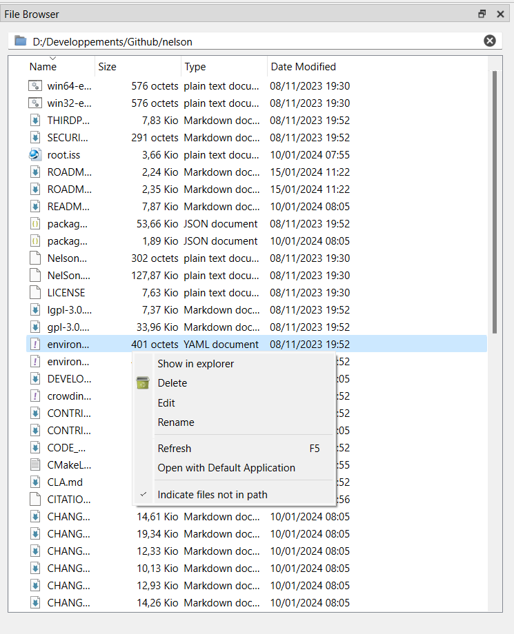

# filebrowser

Current Folder Browser

## Syntax

- filebrowser

## Description

  
The Current Folder browser in Nelson facilitates interactive file and folder management. Utilize it to navigate, create, access, relocate, and rename files and folders within the current directory.

  

    
  

## See also

[historybrowser](historybrowser.html), [workspace](workspace.md).

## History

| Version | Description     |
| ------- | --------------- |
| 1.1.0   | initial version |

## Author

Allan CORNET
