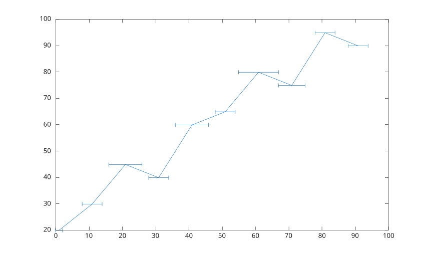
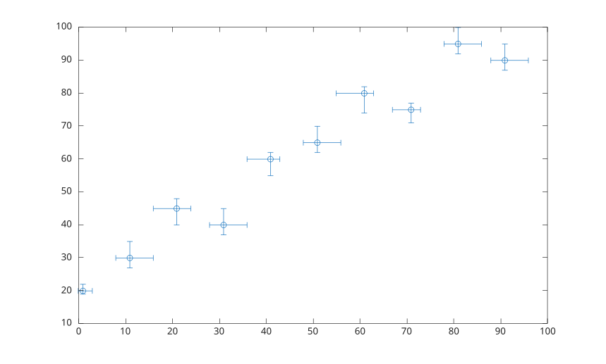

# errorbar

Plot data with error bars.

## 📝 Syntax

- errorbar(Y, E)
- errorbar(X, Y, E)
- errorbar(X, Y, YNEG, YPOS)
- errorbar(..., orientation)
- errorbar(X, Y, YNEG, YPOS, XNEG, XPOS)
- errorbar(..., lineSpec)
- errorbar(..., propertyName, propertyValue)
- errorbar(ax, ...)
- h = errorbar(...)

## 📥 Input argument

- X - x data values.
- Y - y data values.
- E - symmetric y error values.
- YNEG - negative y error values.
- YPOS - positive y error values.
- XNEG - negative x error values.
- XPOS - positive x error values.
- orientation - error bar orientation: <b>'vertical'</b>, <b>'horizontal'</b>, or <b>'both'</b>.
- lineSpec - line style, marker, and color specification.
- propertyName - errorbar object property name.
- propertyValue - errorbar object property value.
- ax - target axes object.

## 📤 Output argument

- h - errorbar graphics object or row vector of errorbar objects for matrix data.

## 📄 Description


<b>errorbar</b> plots x and y data with vertical or combined x/y error bars. 

Vector inputs create one errorbar object. Matrix inputs create one errorbar object for each column. 

See [errorbar properties](../../../graphics/2_graphics_objects/4_properties/nelson.graphics.errorbar.properties.md) for the complete property list.

## 💡 Examples

Plot vertical error bars of equal length.

```matlab
x = 1:10:100;
y = [20 30 45 40 60 65 80 75 95 90];
err = 8 * ones(size(y));
errorbar(x, y, err);

```

Plot vertical error bars that vary in length.

```matlab
x = 1:10:100;
y = [20 30 45 40 60 65 80 75 95 90];
err = [5 8 2 9 3 3 8 3 9 3];
errorbar(x, y, err);

```

Plot horizontal error bars.

```matlab
x = 1:10:100;
y = [20 30 45 40 60 65 80 75 95 90];
err = [1 3 5 3 5 3 6 4 3 3];
errorbar(x, y, err, 'horizontal');

```

Plot vertical and horizontal error bars with markers only.

```matlab
x = 1:10:100;
y = [20 30 45 40 60 65 80 75 95 90];
err = [4 3 5 3 5 3 6 4 3 3];
errorbar(x, y, err, 'both', 'o');

```

Control error bar lengths in all directions.

```matlab
x = 1:10:100;
y = [20 30 45 40 60 65 80 75 95 90];
yneg = [1 3 5 3 5 3 6 4 3 3];
ypos = [2 5 3 5 2 5 2 2 5 5];
xneg = [1 3 5 3 5 3 6 4 3 3];
xpos = [2 5 3 5 2 5 2 2 5 5];
errorbar(x, y, yneg, ypos, xneg, xpos, 'o');

```



## 🔗 See also

[errorbar properties](../../../graphics/2_graphics_objects/4_properties/nelson.graphics.errorbar.properties.md), [plot](../../../graphics/1_plots/1_line_plots/plot.md), [line](../../../graphics/1_plots/1_line_plots/line.md).
<!--
## 👤 Author

Allan CORNET
-->
