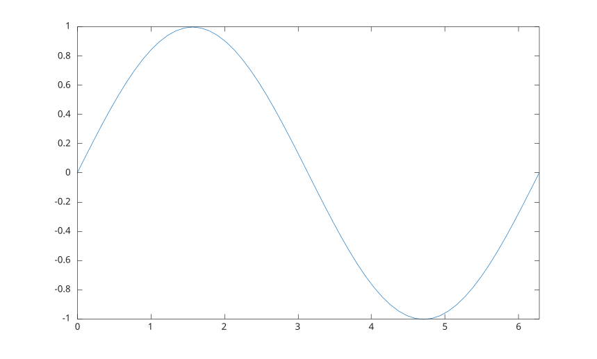

# fplot

Plot an expression or parametric function.

## 📝 Syntax

- fplot(f)
- fplot(f, [xmin xmax])
- fplot(xfun, yfun)
- fplot(xfun, yfun, [tmin tmax])
- fplot(..., lineSpec)
- fplot(..., propertyName, propertyValue)
- fplot(ax, ...)
- h = fplot(...)

## 📥 Input argument

- f - function handle evaluated on x values.
- xfun - function handle evaluated on parameter values to produce x data.
- yfun - function handle evaluated on parameter values to produce y data.
- lineSpec - line style, marker, and color specification.
- propertyName - [line property](../../../graphics/2_graphics_objects/4_properties/nelson.graphics.line.properties.md) name.
- propertyValue - line object property value.
- ax - target axes object.

## 📤 Output argument

- h - <b>functionline</b> graphics object for y = f(x), or <b>parameterizedfunctionline</b> graphics object for x = x(t), y = y(t).

## 📄 Description


<b>fplot</b> samples functions over a finite range and plots the result as a function graphics object. The default range is [-5 5]. 

For y = f(x), <b>fplot</b> returns a <b>functionline</b> object. For parametric curves, it returns a <b>parameterizedfunctionline</b> object. 

See [functionline properties](../../../graphics/2_graphics_objects/4_properties/nelson.graphics.functionline.properties.md) and [parameterizedfunctionline properties](../../../graphics/2_graphics_objects/4_properties/nelson.graphics.parameterizedfunctionline.properties.md) for the complete property lists.

## 💡 Examples


```matlab
fplot(@(x) sin(x), [0 2*pi]);

```



```matlab
fplot(@(x) exp(-x.^2), [-3 3], '-r', 'LineWidth', 1.5);

```


```matlab
fplot(@(t) cos(t), @(t) sin(t), [0 2*pi]);
axis equal

```


## 🔗 See also

[plot](../../../graphics/1_plots/1_line_plots/plot.md), [functionline properties](../../../graphics/2_graphics_objects/4_properties/nelson.graphics.functionline.properties.md), [parameterizedfunctionline properties](../../../graphics/2_graphics_objects/4_properties/nelson.graphics.parameterizedfunctionline.properties.md), [fsurf](../../../graphics/1_plots/7_surfaces_volumes_polygons/fsurf.md).
<!--
## 👤 Author

Allan CORNET
-->
