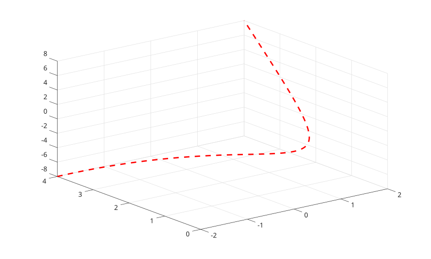

# fplot3

Plot a 3-D parametric curve from function handles.

## 📝 Syntax

- fplot3(xfun, yfun, zfun)
- fplot3(xfun, yfun, zfun, tinterval)
- fplot3(..., LineSpec)
- fplot3(parent, ...)
- h = fplot3(...)

## 📥 Input argument

- xfun, yfun, zfun - Function handles evaluated on the parameter interval.
- tinterval - Two-element increasing finite vector. The default is [-5 5].
- LineSpec - Line style, marker, and color specification.
- Name-Value pairs - Line properties and parameterizedfunctionline properties, including MeshDensity.

## 📤 Output argument

- h - Parameterized function line graphics object.

## 📄 Description


<b>fplot3</b> samples three function handles over a parameter interval and displays the resulting 3-D curve.

## 💡 Examples

Plot a helix.

```matlab
fplot3(@(t) cos(t), @(t) sin(t), @(t) t, [0 6*pi]);
```

Customize line style.

```matlab
fplot3(@(t) t, @(t) t.^2, @(t) t.^3, [-2 2], 'r--', 'LineWidth', 2);
```



## 🔗 See also

[fplot](../../../graphics/1_plots/1_line_plots/fplot.md), [plot3](../../../graphics/1_plots/1_line_plots/plot3.md), [parameterizedfunctionline properties](../../../graphics/2_graphics_objects/4_properties/nelson.graphics.parameterizedfunctionline.properties.md).