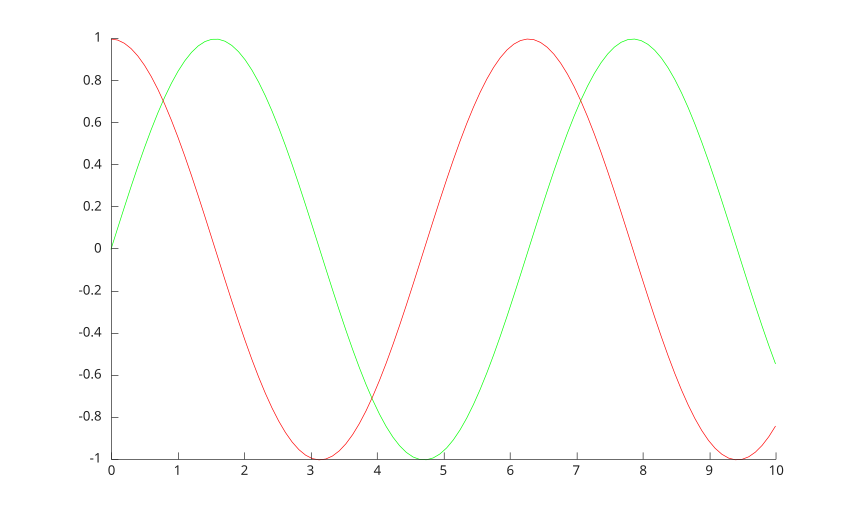
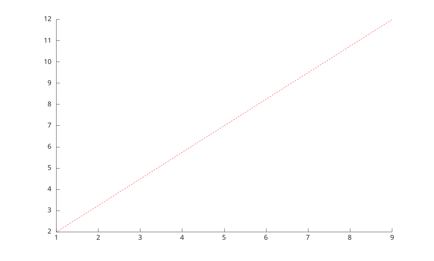
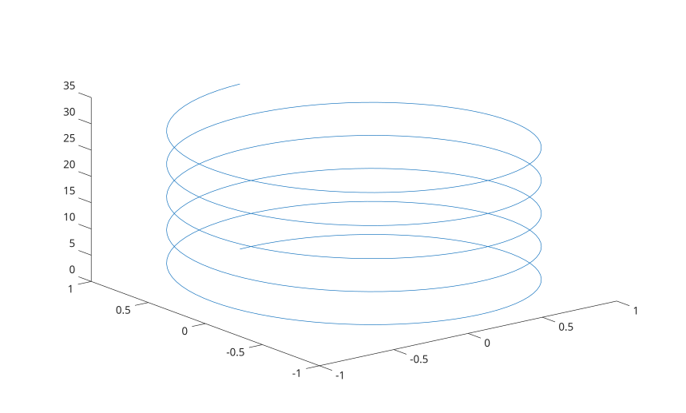

# line

Create primitive line.

## 📝 Syntax

- go = line()
- po = line(x, y)
- go = line(x, y, z)
- go = line(ax, x, y, z)
- go = line(ax, x, y, z, propertyName, propertyValue)

## 📥 Input argument

- x, y , z - a scalar graphics object value: parent container, specified as a figure.
- ax - Target axes: axes object.
- propertyName - a scalar string or row vector character.
- propertyValue - a value.

## 📤 Output argument

- go - a graphics object: line type.

## 📄 Description

<b>line(x, y)</b> creates a line in the current axes with vectors<b>x</b> and <b>y</b>.

<b>line(x, y, z)</b> creates a line in three-dimensional coordinates.

See [line properties](../../../graphics/2_graphics_objects/4_properties/nelson.graphics.line.properties.md) for the complete property list.

<b>BeingDeleted</b> Flag indicating that the object is being deleted.

## 💡 Examples

```matlab
f = figure();
x = linspace(0,10)';
y1 = sin(x);
y2 = cos(x);
line(x, y1, 'Color', [0 1 0])
line(x, y2, 'Color', [1 0 0])

```



```matlab
f = figure();
x = [1 9];
y = [2 12];
line(x,y,'Color','red','LineStyle','--')
```



```matlab
f = figure();
t = linspace(0,10*pi,400);
x = sin(t);
y = cos(t);
z = t;
line(x,y,z)
view(3)
```



## 🔗 See also

[line properties](../../../graphics/2_graphics_objects/4_properties/nelson.graphics.line.properties.md), [plot](../../../graphics/1_plots/1_line_plots/plot.md), [plot3](../../../graphics/1_plots/1_line_plots/plot3.md).

## 🕔 History

| Version | 📄 Description                       |
| ------- | ------------------------------------ |
| 1.0.0   | initial version                      |
| 1.7.0   | CreateFcn, DeleteFcn callback added. |
| --      | BeingDeleted property added.         |
| --      | Polar line properties added.         |

<!--
## 👤 Author

Allan CORNET
-->
