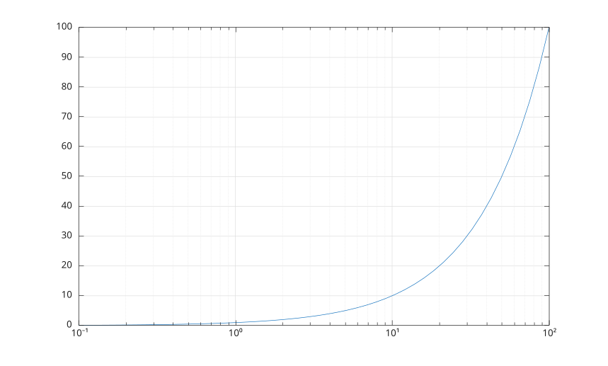
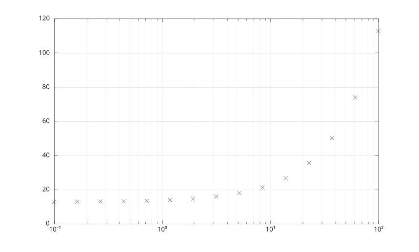

# semilogx

Semilog plot (x-axis has log scale).

## 📝 Syntax

- semilogx(X, Y)
- semilogx(X, Y, LineSpec)
- semilogx(Y)
- semilogx(Y, LineSpec)
- semilogx(ax, ...)
- semilogx(..., propertyName, propertyValue)
- go = semilogx(...)

## 📥 Input argument

- X - Log scale coordinates: scalar, vector or matrix.
- Y - Linear scale coordinates: scalar, vector or matrix.
- LineSpec - Line style, marker, and/or color: character vector or scalar string.
- ax - a scalar graphics object value: parent container, specified as a axes.
- propertyName - a scalar string or row vector character. See [line properties](../../../graphics/2_graphics_objects/4_properties/nelson.graphics.line.properties.md) for the property list.
- propertyValue - a value.

## 📤 Output argument

- go - a graphics object: line type.

## 📄 Description

<b>semilogx(X, Y)</b> plots data using a base 10 logarithmic scale for the x-axis and a normal (linear) scale for the y-axis.

<b>semilogx</b> has the exact same syntax as the <b>plot</b> command.

## 💡 Examples

```matlab
f = figure();
x = logspace(-1,2);
semilogx(x, x);
grid on
```



```matlab
f = figure();
x = logspace(-1, 2, 15);
y = 13 + x;
semilogx(x, y, 'x', 'MarkerFaceColor', [0 0.447 0.741])
grid on
```



## 🔗 See also

[semilogy](../../../graphics/1_plots/1_line_plots/semilogy.md), [line](../../../graphics/1_plots/1_line_plots/line.md), [plot](../../../graphics/1_plots/1_line_plots/plot.md), [grid](../../../graphics/3_labels_styling/1_axes_appearance/grid.md).

## 🕔 History

| Version | 📄 Description  |
| ------- | --------------- |
| 1.0.0   | initial version |

<!--
## 👤 Author

Allan CORNET
-->
