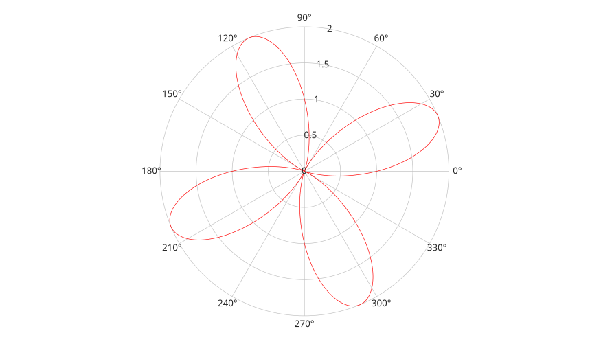

# fpolarplot

Plot a function in polar coordinates.

## 📝 Syntax

- fpolarplot(fun)
- fpolarplot(fun, [tmin tmax])
- fpolarplot(..., LineSpec)
- fpolarplot(..., Name, Value)
- fpolarplot(parent, ...)
- h = fpolarplot(...)

## 📤 Output argument

- h - Function line graphics object drawn in polar axes.

## 📄 Description


<b>fpolarplot</b> samples a function over an angle interval and plots the resulting radius values in polar coordinates. The returned object is a <b>functionline</b>. 

Name-value pairs can set line properties and functionline properties such as <b>MeshDensity</b>.

## 💡 Example

Plot a polar function.

```matlab
fpolarplot(@(t) 1 + sin(4*t), [0 2*pi], 'r-');
```



## 🔗 See also

[polarplot](../../../graphics/1_plots/2_polar_plots/polarplot.md), [fplot](../../../graphics/1_plots/1_line_plots/fplot.md), [functionline properties](../../../graphics/2_graphics_objects/4_properties/nelson.graphics.functionline.properties.md).