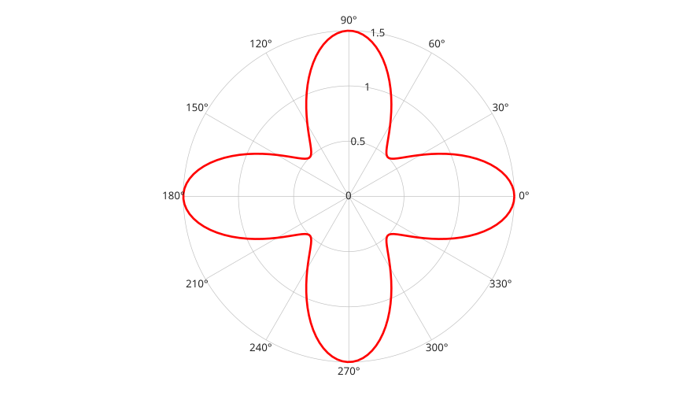

# polarplot

Plot data in polar coordinates.

## 📝 Syntax

- polarplot(rho)
- polarplot(theta, rho)
- polarplot(theta, rho, LineSpec)
- polarplot(..., propertyName, propertyValue, ...)
- polarplot(ax, ...)
- go = polarplot(...)

## 📥 Input argument

- theta - Angles in radians: vector or matrix.
- rho - Radial coordinates: real numeric vector or matrix.
- LineSpec - Line style, marker, and/or color: character vector or scalar string.
- propertyName - Line property name: scalar string or row vector of characters.
- propertyValue - Value assigned to the preceding line property.
- ax - Target polar axes or axes object. A regular axes is initialized as a polar axes.

## 📤 Output argument

- go - Column vector of line graphics objects.

## 📄 Description

<b>polarplot(theta, rho)</b> plots radius values <b>rho</b> at angles <b>theta</b>. Data angles are expressed in radians.

<b>polarplot(rho)</b> plots <b>rho</b> versus angles equally spaced from 0 to 2\*pi. If <b>rho</b> is complex, <b>angle(rho)</b> is used as angle data and <b>abs(rho)</b> as radius data.

If <b>rho</b> is a matrix, each column is plotted as a separate line. A vector <b>theta</b> can be combined with a matrix <b>rho</b> when its length matches one dimension of <b>rho</b>.

The returned line objects keep polar samples in their <b>ThetaData</b> and <b>RData</b> properties. Cartesian <b>XData</b> and <b>YData</b> are managed by the polar renderer.

Axis limit and tick helper functions use degrees for angular values: <b>thetalim</b>, <b>thetaticks</b>, and <b>thetaticklabels</b>.

When no polar axes is current, <b>polarplot</b> creates one. If a regular axes is supplied, it is initialized as a polar axes.

## 💡 Examples

Plot a polar curve with a line specification.

```matlab

theta = linspace(0, 2*pi, 200);
rho = 1 + 0.5*cos(4*theta);
polarplot(theta, rho, 'r-', 'LineWidth', 2);

```


Plot several radius columns on the same polar axes.

```matlab

theta = linspace(0, 2*pi, 100)';
rho = [sin(theta).^2, cos(theta).^2];
go = polarplot(theta, rho);
rticks([0 0.5 1]);
thetaticks(0:45:360);

```

Use an explicit polar axes.

```matlab

f = figure();
ax = polaraxes('Parent', f);
polarplot(ax, linspace(0, pi, 50), linspace(0, 2, 50), 'o-');
rlim(ax, [0 2]);
thetalim(ax, [0 180]);

```

## 🔗 See also

[polaraxes](../../../graphics/1_plots/2_polar_plots/polaraxes.md), [rlim](../../../graphics/3_labels_styling/1_axes_appearance/rlim.md), [rticks](../../../graphics/3_labels_styling/1_axes_appearance/rticks.md), [thetalim](../../../graphics/3_labels_styling/1_axes_appearance/thetalim.md), [thetaticks](../../../graphics/3_labels_styling/1_axes_appearance/thetaticks.md), [plot](../../../graphics/1_plots/1_line_plots/plot.md), [line](../../../graphics/1_plots/1_line_plots/line.md).

## 🕔 History

| Version | 📄 Description  |
| ------- | --------------- |
| 2.0.0   | initial version |

<!--
## 👤 Author

Allan CORNET
-->
