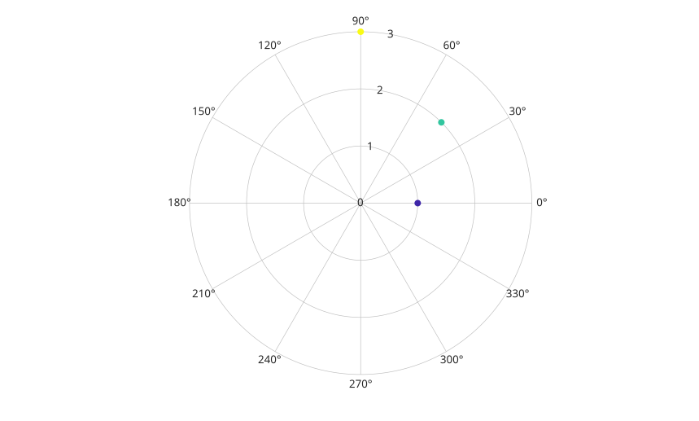

# polarscatter

Display scatter points in polar coordinates.

## 📝 Syntax

- polarscatter(theta, rho)
- polarscatter(theta, rho, sz)
- polarscatter(theta, rho, sz, color)
- polarscatter(tbl, thetavar, rhovar)
- polarscatter(parent, ...)
- h = polarscatter(...)

## 📄 Description


<b>polarscatter</b> displays marker data using polar angle and radius values. 

Table input selects theta and radius data from variables in <b>tbl</b>. Multiple selected variables create multiple <b>scatter</b> objects.

## 💡 Examples

Display filled polar markers.

```matlab
theta = linspace(0, 2*pi, 24);
rho = 1 + sin(3 * theta);
polarscatter(theta, rho, 49, 'r', 'filled');
```

Create a polar scatter chart from a table.

```matlab
t = table([0; pi/4; pi/2], [1; 2; 3], 'VariableNames', {'theta', 'rho'});
h = polarscatter(t, 'theta', 'rho', 'filled');
```



## 🔗 See also

[polarplot](../../../graphics/1_plots/2_polar_plots/polarplot.md), [polarbubblechart](../../../graphics/1_plots/2_polar_plots/polarbubblechart.md).