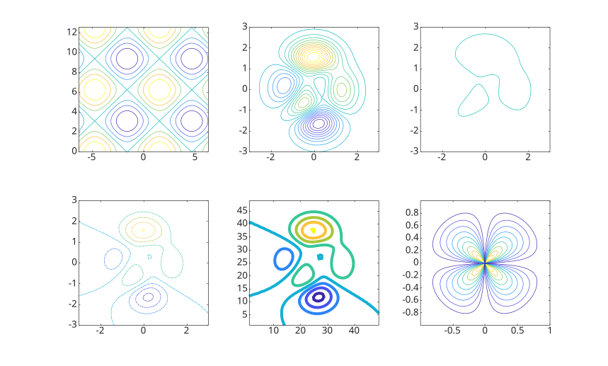

# contour

Contour plot of matrix

## 📝 Syntax

- contour(Z)
- contour(X, Y, Z)
- contour(..., levels)
- contour(..., LineSpec)
- contour(ax, ...)
- M = contour(...)
- [M, h] = contour(...)

## 📥 Input argument

- X - x-coordinates: vector or matrix.
- Y - y-coordinates: vector or matrix.
- Z - z-coordinates: matrix.
- levels - Contour levels: scalar or vector.
- LineSpec - Line specification defining line style and color.
- ax - a scalar graphics object value: parent container specified as an axes.

## 📤 Output argument

- M - Contour matrix.
- h - a graphics object: contour type.

## 📄 Description

<b>contour(Z)</b> generates a contour plot representing isolines of the matrix Z. Each isoline corresponds to a specific height value on the x-y plane.

Nelson automatically selects contour lines based on the values in Z. The column and row indices of Z serve as the x and y coordinates in the plane, respectively.

<b>contour(X, Y, Z)</b> allows the user to specify the x and y coordinates corresponding to the values in matrix Z. This enables more precise control over the positioning of the contour plot on the x-y plane.

The matrices X and Y provide the coordinates, while Z contains the height values for generating the contour plot.

See [contour properties](../../../graphics/2_graphics_objects/4_properties/nelson.graphics.contour.properties.md) for the complete property list.

## 💡 Examples

```matlab

f = figure();
subplot(2, 3, 1)

x = linspace(-2 * pi, 2 * pi);
y = linspace(0, 4 * pi);

[X, Y] = meshgrid(x, y);

Z = sin(X) + cos(Y);

contour(X, Y, Z);

subplot(2, 3, 2)

[X, Y, Z] = peaks;

contour(X, Y, Z, 20)

subplot(2, 3, 3)

[X, Y, Z] = peaks;

v = [1, 1];

contour(X, Y, Z, v)

subplot(2, 3, 4)

[X, Y, Z] = peaks;

contour(X, Y, Z, '-.')

subplot(2, 3, 5)

Z = peaks;

[M, c] = contour(Z);

c.LineWidth = 3;

subplot(2, 3, 6)

[theta, r] = meshgrid(linspace(0, 2 * pi, 64), linspace(0, 1, 64));

[X, Y] = pol2cart(theta, r);

Z = sin(2 * theta) .* (1 - r);

contour(X, Y, abs(Z), 10);

```



```matlab

rng('default');
f = figure();
N = 50;
contour(1:N, 1:N, rand(N), 5)

```


```matlab

f = figure();
Z = peaks;
Z(:, 26) = NaN;
contour(Z)

```


Labeled contour lines.

```matlab

[X, Y, Z] = peaks;

[C, h] = contour(X, Y, Z);

clabel(C, h);

```

## 🔗 See also

[contour properties](../../../graphics/2_graphics_objects/4_properties/nelson.graphics.contour.properties.md), [contourc](../../../graphics/1_plots/3_contour_plots/contourc.md), [contourf](../../../graphics/1_plots/3_contour_plots/contourf.md), [contour3](../../../graphics/1_plots/3_contour_plots/contour3.md), [clabel](../../../graphics/1_plots/3_contour_plots/clabel.md), [surf](../../../graphics/1_plots/7_surfaces_volumes_polygons/surf.md), [mesh](../../../graphics/1_plots/7_surfaces_volumes_polygons/mesh.md).

## 🕔 History

| Version | 📄 Description                           |
| ------- | ---------------------------------------- |
| 1.3.0   | Initial version.                         |
| 1.7.0   | CreateFcn and DeleteFcn callbacks added. |
| 1.8.0   | BeingDeleted property added.             |

<!--
## 👤 Author

Allan CORNET
-->
