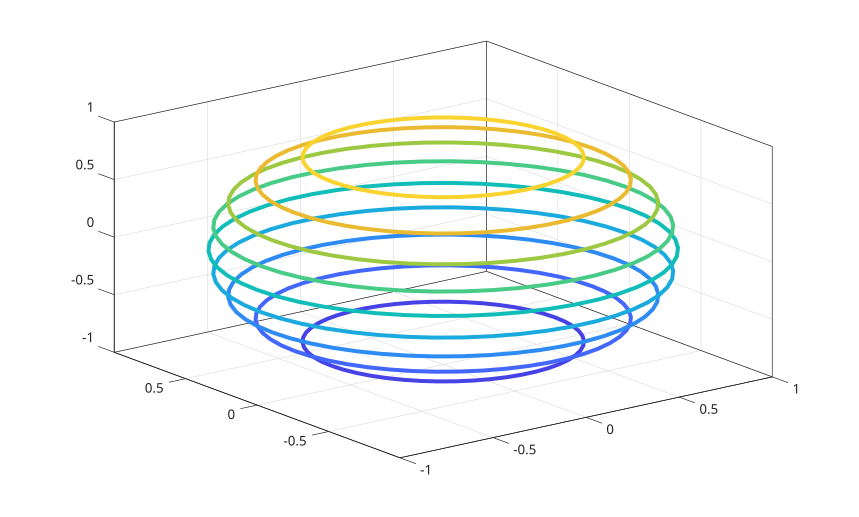

# contour3

Contour 3D plot of matrix

## 📝 Syntax

- contour3(Z)
- contour3(X, Y, Z)
- contour3(..., levels)
- contour3(..., LineSpec)
- contour3(ax, ...)
- M = contour3(...)
- [M, h] = contour3(...)

## 📥 Input argument

- X - x-coordinates: vector or matrix.
- Y - y-coordinates: vector or matrix.
- Z - z-coordinates: vector or matrix.
- levels - Contour levels: scalar or vector.
- LineSpec - Line style and color
- ax - a scalar graphics object value: parent container, specified as a axes.

## 📤 Output argument

- M - Contour matrix.
- h - a graphics object: contour type.

## 📄 Description

<b>contour3(Z)</b> generates a 3-D contour plot illustrating the isolines of the matrix Z, where Z represents heights on the x-y plane.

The x and y coordinates in the plane correspond to the column and row indices of Z, respectively.

To specify the x and y coordinates for Z values, use <b>contour3(X,Y,Z)</b>.

## 💡 Example

```matlab
f = figure();
[X,Y,Z] = sphere(50);
[M, C ]= contour3(X,Y,Z);
C.LineWidth = 3;
```



## 🔗 See also

[contour](../../../graphics/1_plots/3_contour_plots/contour.md), [contourc](../../../graphics/1_plots/3_contour_plots/contourc.md), [contourf](../../../graphics/1_plots/3_contour_plots/contourf.md), [clabel](../../../graphics/1_plots/3_contour_plots/clabel.md), [surf](../../../graphics/1_plots/7_surfaces_volumes_polygons/surf.md), [mesh](../../../graphics/1_plots/7_surfaces_volumes_polygons/mesh.md).

## 🕔 History

| Version | 📄 Description  |
| ------- | --------------- |
| 1.3.0   | initial version |

<!--
## 👤 Author

Allan CORNET
-->
