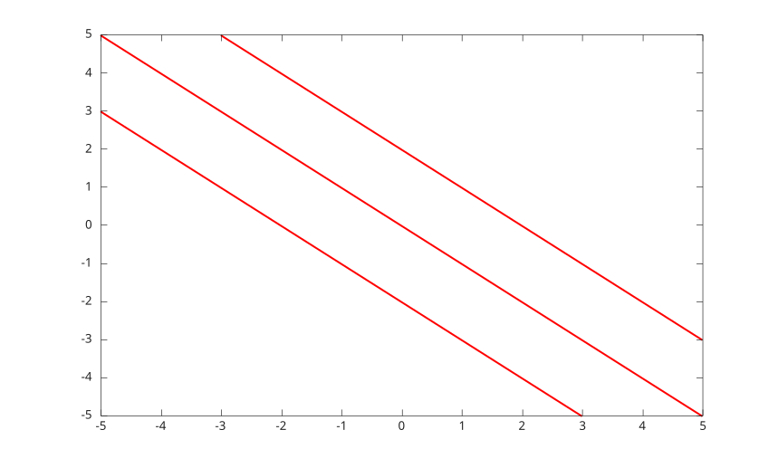

# fcontour

Plot contours from a function of two variables.

## 📝 Syntax

- fcontour(fun)
- fcontour(fun, xyinterval)
- fcontour(fun, [xmin xmax ymin ymax])
- fcontour(..., LineSpec)
- fcontour(..., propertyName, propertyValue)
- fcontour(parent, ...)
- h = fcontour(...)

## 📄 Description

<b>fcontour</b> samples <b>fun(x,y)</b> on a regular grid and displays contour lines as a <b>functioncontour</b> graphics object.

See [functioncontour properties](../../../graphics/2_graphics_objects/4_properties/nelson.graphics.functioncontour.properties.md) for the complete property list.

## 💡 Examples

Display function contours.

```matlab
fcontour(@(x, y) x.^2 - y.^2, [-2 2 -2 2]);
```


Use a line color and explicit levels.

```matlab
h = fcontour(@(x, y) x + y, '-r', 'LevelList', [-2 0 2]);
h.LineWidth = 1.5;
```



## 🔗 See also

[functioncontour properties](../../../graphics/2_graphics_objects/4_properties/nelson.graphics.functioncontour.properties.md), [contour](../../../graphics/1_plots/3_contour_plots/contour.md), [fmesh](../../../graphics/1_plots/7_surfaces_volumes_polygons/fmesh.md).
