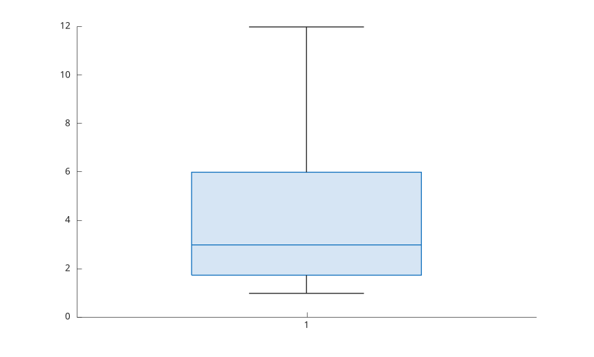
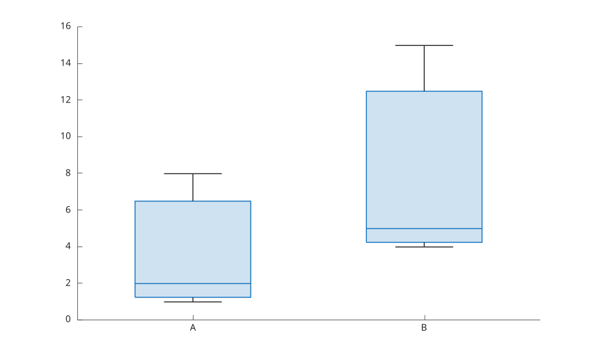
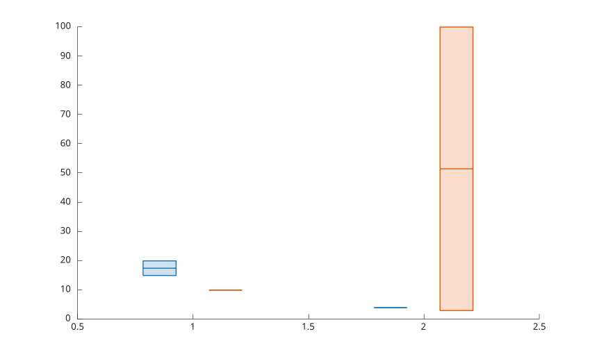
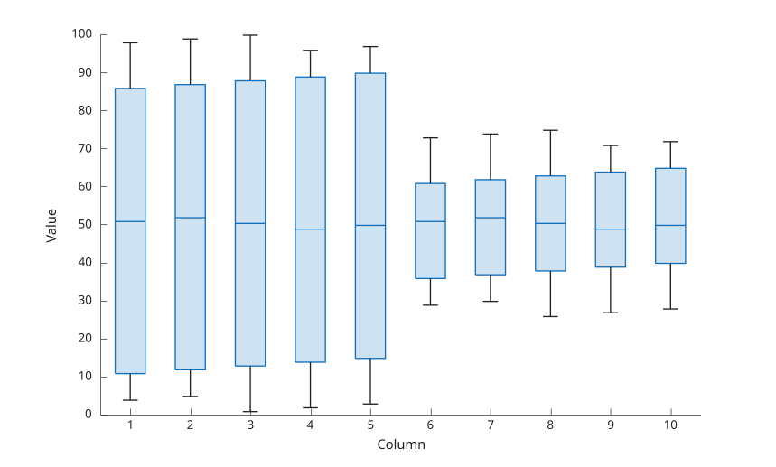
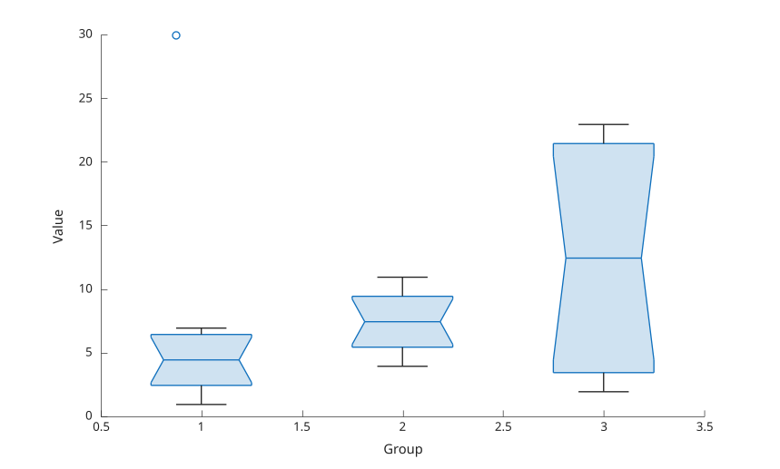
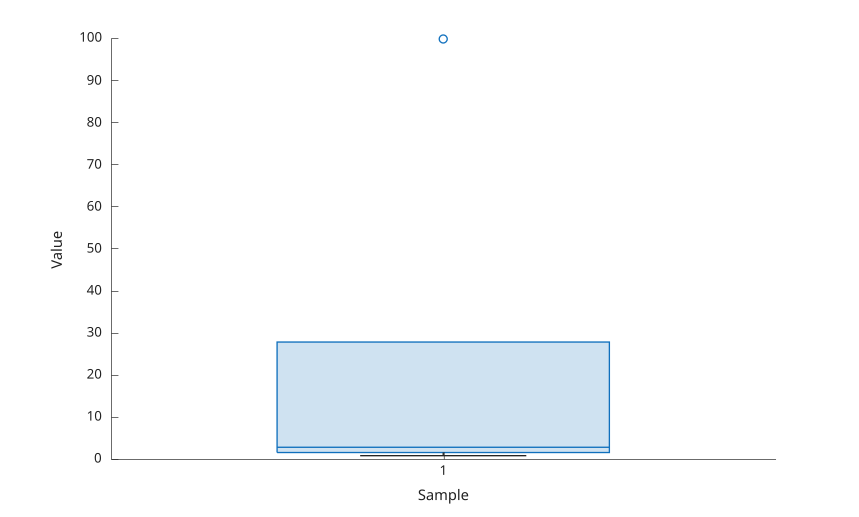

# boxchart

Display box chart for grouped numeric data.

## 📝 Syntax

- boxchart(ydata)
- boxchart(xgroupdata, ydata)
- boxchart(..., 'GroupByColor', cgroupdata)
- boxchart(tbl, yvar)
- boxchart(tbl, xvar, yvar)
- boxchart(parent, ...)
- boxchart(..., propertyName, propertyValue)
- h = boxchart(...)

## 📄 Description

<b>boxchart</b> displays box charts for numeric data. The returned value is one or more graphics objects with <b>Type</b> set to <b>boxchart</b>.

The chart computes quartiles, median, whiskers, caps, outliers, and optional notches for each numeric group. NaN values are ignored when statistics are computed.

See [boxchart properties](../../../graphics/2_graphics_objects/4_properties/nelson.graphics.boxchart.properties.md) for the complete property list.

## 💡 Examples

Single box chart.

```matlab
f = figure();
boxchart([1 2 3 4 12], 'BoxFaceColor', [0.2 0.5 0.8]);

```


Grouped box chart.

```matlab
f = figure();
g = categorical({'A', 'A', 'A', 'B', 'B', 'B'});
y = [1 2 8 4 5 15];
boxchart(g, y, 'MarkerStyle', 'x');

```


Color groups.

```matlab
f = figure();
x = [1 1 2 2 2 1];
y = [10 20 3 4 100 15];
c = categorical({'red', 'blue', 'red', 'blue', 'red', 'blue'});
boxchart(x, y, 'GroupByColor', c);

```


Box charts for the columns of a matrix.

```matlab
f = figure();
Y = magic(10);
boxchart(Y);
xlabel('Column');
ylabel('Value');

```


Notches and jittered outliers.

```matlab
f = figure();
x = [ones(1, 8), 2 * ones(1, 8), 3 * ones(1, 8)];
y = [1 2 3 4 5 6 7 30, 4 5 6 7 8 9 10 11, 2 3 4 5 20 21 22 23];
boxchart(x, y, 'Notch', 'on', 'JitterOutliers', 'on');
xlabel('Group');
ylabel('Value');

```


Outlier marker and box hinges.

```matlab
f = figure();
boxchart([1 2 3 4 100]);
xlabel('Sample');
ylabel('Value');

```



## 🔗 See also

[boxchart properties](../../../graphics/2_graphics_objects/4_properties/nelson.graphics.boxchart.properties.md), [boxplot](../../../graphics/1_plots/4_data_distribution_plots/boxplot.md).
