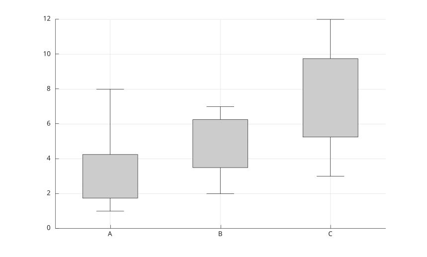

# boxplot

Display box plots for numeric data.

## 📝 Syntax

- boxplot(X)
- boxplot(X, group)
- boxplot(parent, ...)
- boxplot(..., propertyName, propertyValue)
- h = boxplot(...)

## 📥 Input argument

- X - Numeric vector or matrix. Matrix columns are displayed as separate boxes.
- group - Grouping values for vector data.
- parent - Axes or hggroup parent.

## 📤 Output argument

- h - Graphics group containing patches and line objects for boxes, whiskers, medians, and outliers.

## 📄 Description

<b>boxplot</b> displays quartiles, median, whiskers, and outliers for numeric data. NaN values are ignored.

Supported properties are <b>Labels</b>, <b>Orientation</b>, <b>Widths</b>, <b>Whisker</b>, <b>Symbol</b>, <b>Colors</b>, <b>LineWidth</b>, <b>ShowOutliers</b>, <b>Notch</b>, <b>Positions</b>, and <b>BoxStyle</b>.

## 💡 Examples

Box plots for matrix columns.

```matlab
X = [1 2 3; 2 4 6; 3 6 9; 8 7 12];
boxplot(X, 'Labels', {'A', 'B', 'C'});
```


Grouped heights with text labels.

```matlab
girls = randn(10, 1) * 5 + 140;
boys = randn(13, 1) * 8 + 135;
heights = [girls; boys];
sex = [ones(numel(girls), 1); 2 * ones(numel(boys), 1)];
boxplot(heights, sex, 'Labels', {'girls', 'boys'});
xlim([0 3]);
title('Grade 3 heights');
```

Group splitting with explicit positions.

```matlab
data = [(randn(10, 1) * 5 + 140); (randn(25, 1) * 8 + 135); ...
  (randn(20, 1) * 6 + 165)];
groups = [ones(10, 1); ones(25, 1) * 2; ones(20, 1) * 3];
labels = {'Team A', 'Team B', 'Team C'};
pos = [2, 1, 3];
boxplot(data, groups, 'Notch', 'on', 'Labels', labels, 'Positions', pos, ...
  'BoxStyle', 'filled', 'Widths', 0.45);
title('Group splitting with paired vectors');
```

Colors specified with characters.

```matlab
boxplot(randn(100, 9), 'Notch', 'on', 'BoxStyle', 'filled', ...
  'Colors', 'ygcwkmb', 'Whisker', 1.2);
title('Different colors specified with characters');
```

Colors specified as RGB values.

```matlab
colors = [0.7 0.7 0.7; 0.0 0.4 0.9; 0.7 0.4 0.3; ...
  0.7 0.1 0.7; 0.8 0.7 0.4; 0.1 0.8 0.5; 0.9 0.9 0.2];
boxplot(randn(100, 13), 'Notch', 'on', 'BoxStyle', 'filled', ...
  'Colors', colors, 'Whisker', 1.3, 'Widths', 0.45);
title('Different colors specified as RGB values');
```

Grouped horizontal box plots.

```matlab
y = [1 2 3 4 10 11 12 25];
g = {'left', 'left', 'left', 'left', 'right', 'right', 'right', 'right'};
boxplot(y, g, 'Orientation', 'horizontal', 'Symbol', 'rx');
```

## 🔗 See also

[boxchart](../../../graphics/1_plots/4_data_distribution_plots/boxchart.md), [plot](../../../graphics/1_plots/1_line_plots/plot.md).
