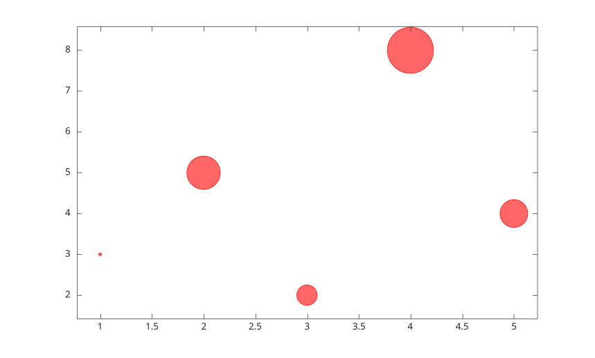
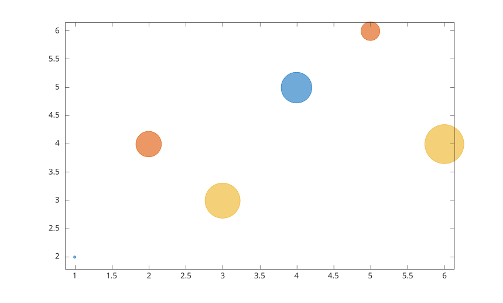

# bubblechart

Display bubble chart.

## 📝 Syntax

- bubblechart(x, y, sz)
- bubblechart(x, y, sz, c)
- bubblechart(tbl, xvar, yvar, sizevar)
- bubblechart(tbl, xvar, yvar, sizevar, cvar)
- bubblechart(parent, ...)
- bubblechart(..., propertyName, propertyValue)
- h = bubblechart(...)

## 📄 Description

<b>bubblechart</b> displays a chart whose circular marker sizes are controlled by <b>sz</b>.

<b>x</b>, <b>y</b>, and <b>sz</b> can be vectors or matrices. Vector <b>x</b> and <b>y</b> with scalar <b>sz</b> create one bubblechart object per point. Matrix inputs create one object per data series.

<b>c</b> specifies bubble colors. It can be a color name, short color name, RGB triplet, color vector, or RGB matrix.

Table syntax reads variables from <b>tbl</b>. Variable selectors can be names, string arrays, cell arrays of names, numeric indices, or logical vectors.

See [bubblechart properties](../../../graphics/2_graphics_objects/4_properties/nelson.graphics.bubblechart.properties.md) for the complete property list.

## 💡 Examples

Display a bubble chart.

```matlab
bubblechart(1:5, [3 5 2 8 4], [20 50 30 80 40], 'BubbleColor', 'r');
```


Display several series from matrix data.

```matlab
x = [1 2 3; 4 5 6];
y = [2 4 3; 5 6 4];
sz = [20 40 60; 50 30 70];
bubblechart(x, y, sz);
```


Use table variables.

```matlab
t = table((1:4)', [4; 2; 6; 3], [20; 60; 30; 80], [1; 2; 3; 4], ...
  'VariableNames', {'x', 'y', 's', 'c'});
bubblechart(t, 'x', 'y', 's', 'c');
```


## 🔗 See also

[bubblechart properties](../../../graphics/2_graphics_objects/4_properties/nelson.graphics.bubblechart.properties.md), [scatter](../../../graphics/1_plots/4_data_distribution_plots/scatter.md), [bubblechart3](../../../graphics/1_plots/4_data_distribution_plots/bubblechart3.md).
