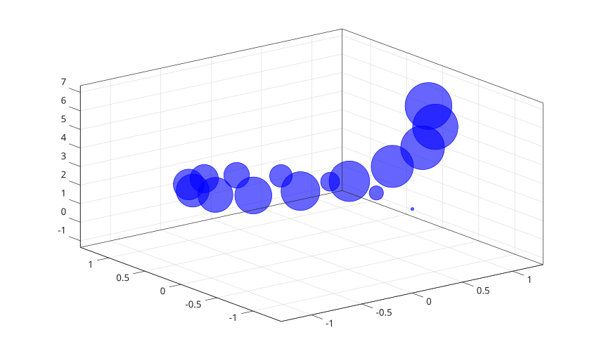

# bubblechart3

Display 3-D bubble chart.

## 📝 Syntax

- bubblechart3(x, y, z, sz)
- bubblechart3(x, y, z, sz, c)
- bubblechart3(tbl, xvar, yvar, zvar, szvar)
- bubblechart3(tbl, xvar, yvar, zvar, szvar, cvar)
- bubblechart3(parent, ...)
- bubblechart3(..., propertyName, propertyValue)
- h = bubblechart3(...)

## 📄 Description

<b>bubblechart3</b> displays a 3-D scatter plot whose marker sizes are controlled by <b>sz</b>.

<b>c</b> specifies bubble colors. It can be a color name, short color name, RGB triplet, color vector, or RGB matrix.

Table input selects data from variables in <b>tbl</b>. Each variable selector can be a variable name, string, index, logical selector, or a cell/string vector of names. Multiple selected variables create multiple <b>bubblechart</b> objects.

The returned handle is a <b>bubblechart</b> object with <b>XData</b>, <b>YData</b>, <b>ZData</b>, and <b>SizeData</b>.

See [bubblechart properties](../../../graphics/2_graphics_objects/4_properties/nelson.graphics.bubblechart.properties.md) for the complete property list.

## 💡 Examples

Display a 3-D bubble chart.

```matlab
t = 0:0.4:2*pi;
bubblechart3(cos(t), sin(t), t, 30 + 20 * t, 'b');
```


Create a 3-D bubble chart from a table.

```matlab
t = table((1:4)', [4; 2; 6; 3], [7; 8; 9; 10], [20; 60; 30; 80], [1; 2; 3; 4], ...
  'VariableNames', {'x', 'y', 'z', 's', 'c'});
h = bubblechart3(t, 'x', 'y', 'z', 's', 'c');
```


## 🔗 See also

[bubblechart properties](../../../graphics/2_graphics_objects/4_properties/nelson.graphics.bubblechart.properties.md), [scatter3](../../../graphics/1_plots/4_data_distribution_plots/scatter3.md), [bubblechart](../../../graphics/1_plots/4_data_distribution_plots/bubblechart.md).
