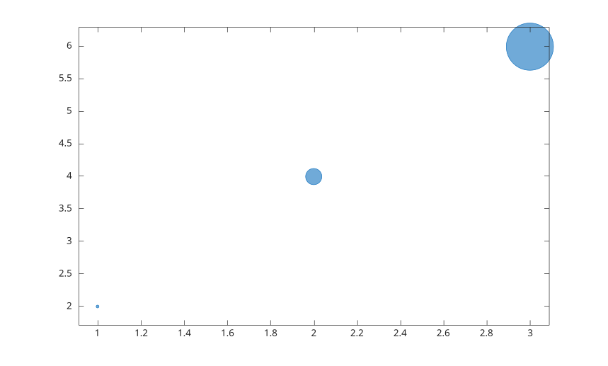

# bubblelim

Set or query bubble size data limits.

## 📝 Syntax

- bubblelim(limits)
- bubblelim('auto')
- bubblelim('manual')
- bubblelim(ax, ...)
- limits = bubblelim()
- mode = bubblelim('mode')

## 📥 Input argument

- limits - Two-element numeric vector [min max].
- ax - Target axes. If omitted, the current axes is used.

## 📤 Output argument

- limits - Current bubble size data limits.

## 📄 Description

<b>bubblelim</b> controls the data limits used to map <b>SizeData</b> values to rendered bubble diameters.

## 💡 Example

Set bubble limits.

```matlab
figure();
bubblechart(1:3, [2 4 6], [10 100 1000]);
bubblelim([10 1000]);
```



## 🔗 See also

[bubblechart](../../../graphics/1_plots/4_data_distribution_plots/bubblechart.md), [bubblesize](../../../graphics/1_plots/4_data_distribution_plots/bubblesize.md).

<!--
## 👤 Author

Allan CORNET
-->
