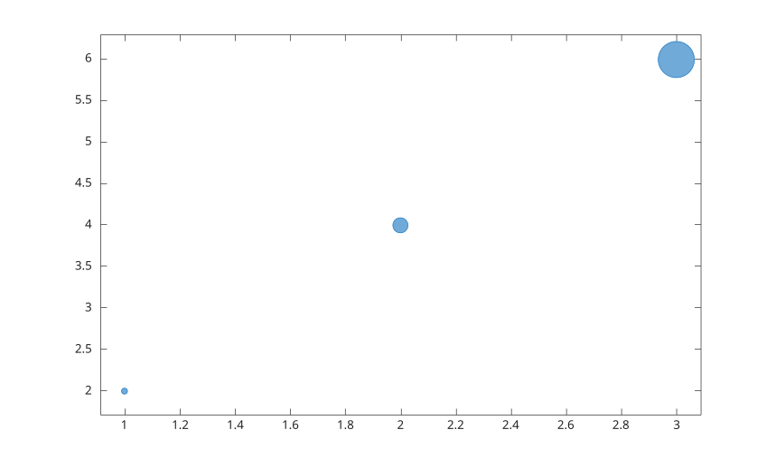

# bubblesize

Set or query rendered bubble diameter range.

## 📝 Syntax

- bubblesize(range)
- bubblesize(ax, range)
- range = bubblesize()

## 📥 Input argument

- range - Two-element positive numeric vector [min max], in points.
- ax - Target axes. If omitted, the current axes is used.

## 📤 Output argument

- range - Current rendered bubble diameter range.

## 📄 Description


<b>bubblesize</b> controls the minimum and maximum rendered bubble diameters for bubble charts in an axes.

## 💡 Example

Reduce bubble sizes.

```matlab
figure();
bubblechart(1:3, [2 4 6], [10 100 1000]);
bubblesize([5 30]);
```



## 🔗 See also

[bubblechart](../../../graphics/1_plots/4_data_distribution_plots/bubblechart.md), [bubblelim](../../../graphics/1_plots/4_data_distribution_plots/bubblelim.md).
<!--
## 👤 Author

Allan CORNET
-->
