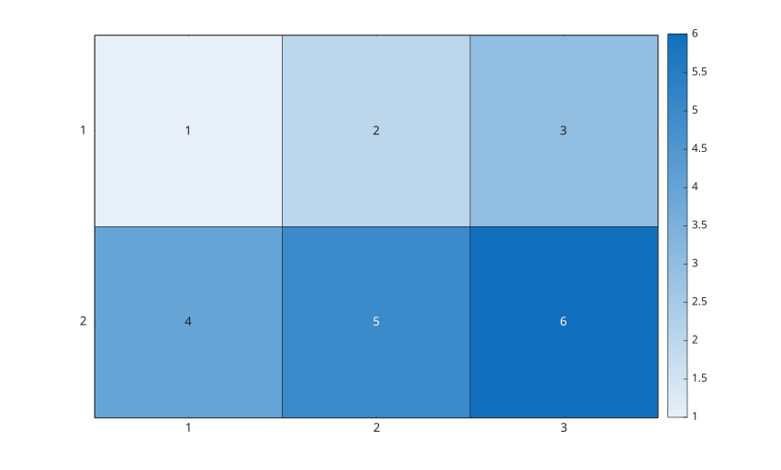

# heatmap

Create a heatmap chart from a numeric matrix or table.

## 📝 Syntax

- heatmap(C)
- heatmap(xvalues, yvalues, C)
- heatmap(tbl, xvar, yvar)
- heatmap(tbl, xvar, yvar, 'ColorVariable', cvar)
- heatmap(parent, ...)
- heatmap(..., propertyName, propertyValue)
- h = heatmap(...)

## 📥 Input argument

- C - Numeric matrix used as color data.
- xvalues - Labels for matrix columns: cell string, string, character, or numeric vector.
- yvalues - Labels for matrix rows: cell string, string, character, or numeric vector.
- tbl - Source table used to calculate heatmap values.
- xvar - Table variable used for x categories.
- yvar - Table variable used for y categories.
- cvar - Numeric table variable averaged for each x/y category pair.
- parent - Axes or hggroup parent.
- propertyName - Supported property name.
- propertyValue - Property value.

## 📤 Output argument

- h - Heatmap chart object containing the heatmap image, grid, labels, and colorbar state.

## 📄 Description


<b>heatmap</b> displays a numeric matrix as a scaled color image with row and column labels. For table input, categories are sorted and the color data is aggregated by category pair. 

With <b>heatmap(tbl, xvar, yvar)</b>, color data contains counts and <b>ColorMethod</b> is <b>count</b>. With <b>ColorVariable</b>, color data contains means and <b>ColorMethod</b> is <b>mean</b>. 

This implementation returns a <b>heatmap</b> chart object. The chart <b>UserData</b> contains the fields <b>ChartType</b>, <b>Image</b>, <b>Grid</b>, <b>CellLabels</b>, <b>Colorbar</b>, <b>XData</b>, <b>YData</b>, <b>ColorData</b>, <b>SourceTable</b>, <b>XVariable</b>, <b>YVariable</b>, <b>ColorVariable</b>, <b>ColorMethod</b>, and <b>Options</b>. 

Supported name/value properties are <b>Title</b>, <b>XLabel</b>, <b>YLabel</b>, <b>SourceTable</b>, <b>XVariable</b>, <b>YVariable</b>, <b>ColorVariable</b>, <b>ColorMethod</b>, <b>XData</b>, <b>YData</b>, <b>XDisplayLabels</b>, <b>YDisplayLabels</b>, <b>ColorLimits</b>, <b>Colormap</b>, <b>ColorbarVisible</b>, <b>GridVisible</b>, <b>CellLabelFormat</b>, <b>CellLabelColor</b>, <b>MissingDataLabel</b>, <b>FontColor</b>, <b>FontSize</b>, and <b>Visible</b>.

## 💡 Examples

Display a numeric heatmap.

```matlab
C = [1 2 3; 4 5 6];
heatmap(C);
```

Use row and column labels.

```matlab
C = [3 7 2; 6 5 8];
heatmap({'A', 'B', 'C'}, {'Low', 'High'}, C, ...
  'Title', 'Scores', 'XLabel', 'Column', 'YLabel', 'Group');
```

Create a heatmap from table categories.

```matlab
T = table({'B'; 'A'; 'B'}, {'Y'; 'X'; 'X'}, [2; 5; 8], ...
  'VariableNames', {'x', 'y', 'v'});
heatmap(T, 'x', 'y', 'ColorVariable', 'v');
```

Customize colors and labels.

```matlab
C = peaks(12);
heatmap(C, 'ColorLimits', [-6 8], 'Colormap', turbo(64), ...
  'CellLabelFormat', '%0.1f', 'GridVisible', 'off');
```


## 🔗 See also

[imagesc](../../../graphics/4_images/imagesc.md), [colorbar](../../../graphics/3_labels_styling/4_labels_annotations/colorbar.md), [colormap](../../../graphics/3_labels_styling/2_color_styling/colormaps/colormap.md).