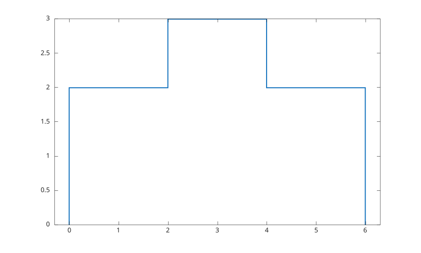
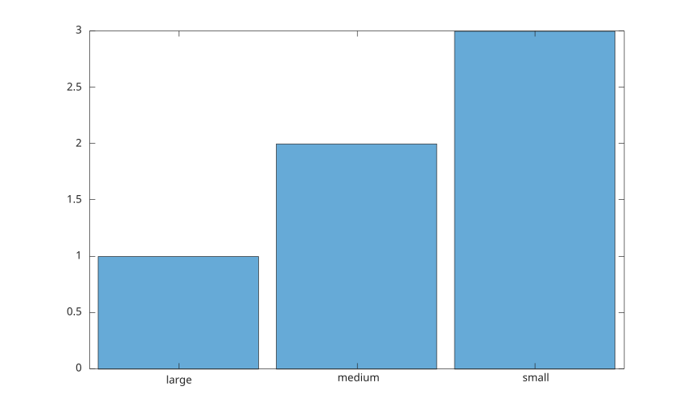

# histogram

Create histogram plot.

## 📝 Syntax

- histogram(X)
- histogram(X, nbins)
- histogram(X, edges)
- histogram(C)
- histogram(C, categories)
- histogram(..., propertyName, propertyValue)
- histogram(ax, ...)
- h = histogram(...)

## 📥 Input argument

- X - numeric input data.
- nbins - number of bins.
- edges - strictly increasing bin edges.
- C - categorical input data.
- categories - cell array of character vectors or string array selecting the categories to display and their order.
- propertyName - histogram object property name.
- propertyValue - histogram object property value.
- ax - target axes object.

## 📤 Output argument

- h - histogram graphics object.

## 📄 Description


<b>histogram</b> bins numeric data and displays the bin values as bars or stairs. 

When <b>C</b> is a categorical array, <b>histogram</b> draws one bar per category, with a bar height equal to the number of elements in that category. The bars are displayed in category order (as returned by <b>categories</b>), and the category names are used as tick labels. A second argument may list the categories to display and their order. 

See [histogram properties](../../../graphics/2_graphics_objects/4_properties/nelson.graphics.histogram.properties.md) for the complete property list.

## 💡 Examples


```matlab
x = [1 1 2 2 2 3 4 4 5];
histogram(x);

```


```matlab
x = randn(200, 1);
histogram(x, 12, 'Normalization', 'probability', 'FaceAlpha', 0.5);

```


```matlab
x = [1 1 2 3 3 4 5];
h = histogram(x, [0 2 4 6], 'DisplayStyle', 'stairs');
h.LineWidth = 1.5;

```

Categorical histogram: one bar per category, counts in category order.

```matlab
C = categorical({'small', 'medium', 'large', 'small', 'medium', 'small'});
histogram(C);

```



## 🔗 See also

[histogram properties](../../../graphics/2_graphics_objects/4_properties/nelson.graphics.histogram.properties.md), [hist](../../../graphics/1_plots/4_data_distribution_plots/hist.md), [bar](../../../graphics/1_plots/6_discrete_data_plots/bar.md).
<!--
## 👤 Author

Allan CORNET
-->
