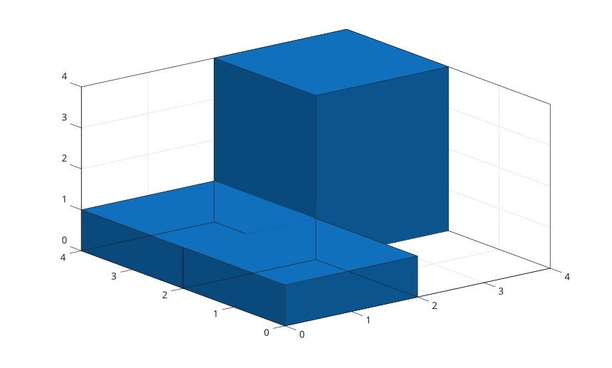

# histogram2

Create bivariate histogram plot.

## 📝 Syntax

- histogram2(X, Y)
- histogram2(X, Y, nbins)
- histogram2(X, Y, xedges, yedges)
- histogram2(..., propertyName, propertyValue)
- histogram2(ax, ...)
- h = histogram2(...)

## 📥 Input argument

- X - x data values.
- Y - y data values with the same number of elements as X.
- nbins - number of bins, specified as a scalar or two-element vector.
- xedges - strictly increasing x bin edges.
- yedges - strictly increasing y bin edges.
- propertyName - histogram2 object property name.
- propertyValue - histogram2 object property value.
- ax - target axes object.

## 📤 Output argument

- h - histogram2 graphics object.

## 📄 Description

<b>histogram2</b> bins paired numeric data and displays the bin values as 3-D bars or a tiled surface.

See [histogram2 properties](../../../graphics/2_graphics_objects/4_properties/nelson.graphics.histogram2.properties.md) for the complete property list.

## 💡 Examples

```matlab
x = [1 1 2 3 4 4];
y = [1 2 2 3 3 4];
histogram2(x, y, [0 2 4], [0 2 4]);

```



```matlab
x = randn(400, 1);
y = 0.5 * x + randn(400, 1);
histogram2(x, y, [12 10], 'Normalization', 'probability');

```


```matlab
x = [1 1 2 3 4 4];
y = [1 2 2 3 3 4];
h = histogram2(x, y, [0 2 4], [0 2 4], 'DisplayStyle', 'tile');
h.ShowEmptyBins = 'on';

```


## 🔗 See also

[histogram2 properties](../../../graphics/2_graphics_objects/4_properties/nelson.graphics.histogram2.properties.md), [histogram](../../../graphics/1_plots/4_data_distribution_plots/histogram.md), [surf](../../../graphics/1_plots/7_surfaces_volumes_polygons/surf.md).

<!--
## 👤 Author

Allan CORNET
-->
