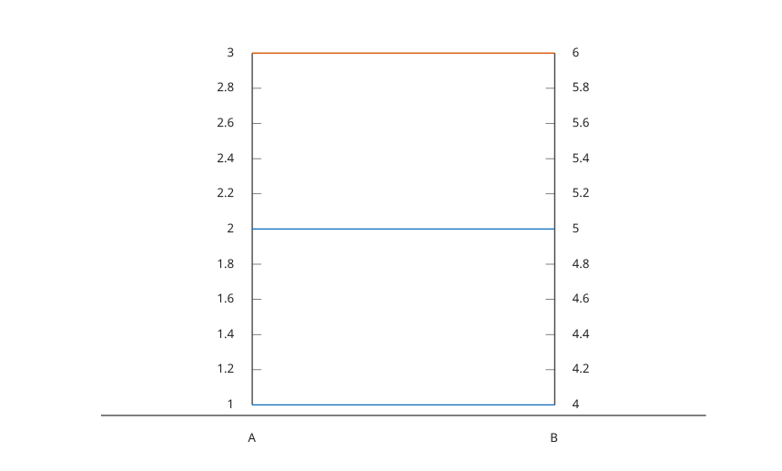

# parallelplot

Display parallel coordinates plot.

## 📝 Syntax

- parallelplot(X)
- parallelplot(T)
- parallelplot(T, 'CoordinateVariables', variables)
- parallelplot(..., 'GroupData', group)
- parallelplot(..., 'GroupVariable', groupVariable)
- parallelplot(..., 'CoordinateTickLabels', labels)
- h = parallelplot(...)

## 📄 Description


<b>parallelplot</b> displays rows of a numeric matrix or numeric table variables as parallel coordinate lines. 

The returned object has type <b>parallelplot</b>. See [parallelplot properties](../../../graphics/2_graphics_objects/4_properties/nelson.graphics.parallelplot.properties.md) for the complete property list.

## 💡 Examples

Plot matrix rows as parallel coordinates.

```matlab
X = [1 10 100; 2 20 50; 3 30 0; 4 15 70];
parallelplot(X, 'CoordinateTickLabels', {'A', 'B', 'C'});
```

Plot selected table variables and group rows by a table variable.

```matlab
T = table([1; 2; 3], [4; 5; 6], {'a'; 'a'; 'b'}, 'VariableNames', {'A', 'B', 'G'});
parallelplot(T, 'CoordinateVariables', {'A', 'B'}, 'GroupVariable', 'G');
```



## 🔗 See also

[plotmatrix](../../../graphics/1_plots/4_data_distribution_plots/plotmatrix.md), [stackedplot](../../../graphics/1_plots/4_data_distribution_plots/stackedplot.md), [parallelplot properties](../../../graphics/2_graphics_objects/4_properties/nelson.graphics.parallelplot.properties.md), [table](../../../table/1_create_convert_tables/table.md).