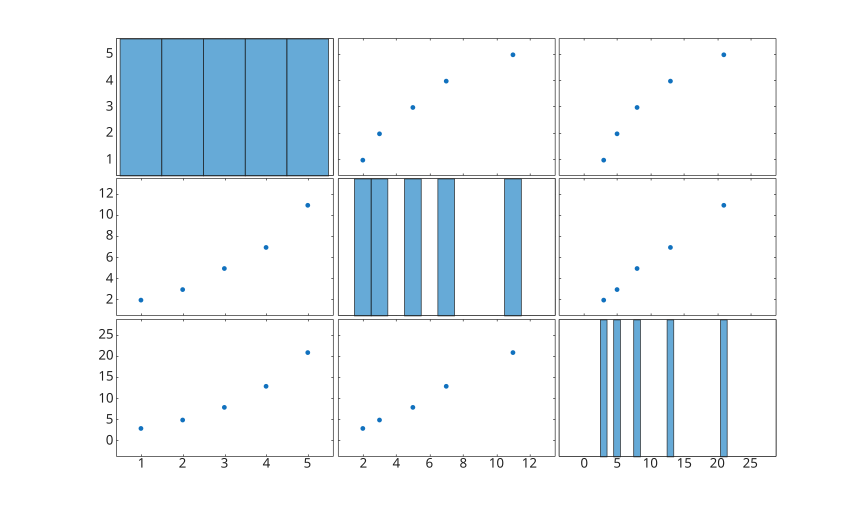
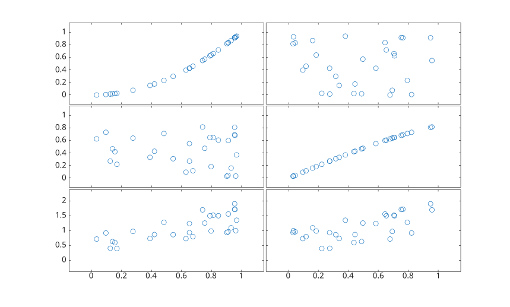

# plotmatrix

Display a matrix of pairwise plots.

## 📝 Syntax

- plotmatrix(X)
- plotmatrix(X, Y)
- plotmatrix(..., marker)
- [h, ax, bigax, p, pax] = plotmatrix(...)

## 📄 Description


<b>plotmatrix</b> creates a grid of pairwise plots for the columns of numeric matrices. With one input matrix, the diagonal cells include histograms returned in <b>p</b>, while <b>h</b> contains the scatter line objects.

## 💡 Examples

Create a plot matrix for three variables.

```matlab
X = [1 2 3; 2 3 5; 3 5 8; 4 7 13; 5 11 21];
plotmatrix(X);
```

Compare columns from two matrices.

```matlab
X = rand(30, 2);
Y = [X(:, 1).^2, sin(X(:, 2)), X(:, 1) + X(:, 2)];
plotmatrix(X, Y, 'o');
```



## 🔗 See also

[scatter](../../../graphics/1_plots/4_data_distribution_plots/scatter.md), [histogram](../../../graphics/1_plots/4_data_distribution_plots/histogram.md), [subplot](../../../graphics/2_graphics_objects/2_layout_objects/subplot.md).