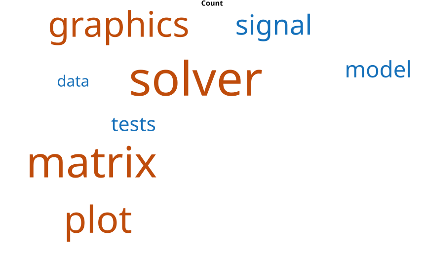

# wordcloud

Display words with sizes proportional to weights.

## 📝 Syntax

- wordcloud(words, sizes)
- wordcloud(words)
- wordcloud(tbl, wordvar, sizevar)
- wordcloud(parent, ...)
- h = wordcloud(...)

## 📄 Description

<b>wordcloud</b> creates a word cloud chart whose font sizes are based on numeric weights or category counts and returns a <b>wordcloud</b> graphics object.

<b>wordcloud(tbl, wordvar, sizevar)</b> uses the table variable <b>wordvar</b> as word labels and <b>sizevar</b> as numeric weights.

The returned object stores the displayed words in <b>WordData</b> and their weights in <b>SizeData</b>.

The [wordcloud properties](../../../graphics/2_graphics_objects/4_properties/nelson.graphics.wordcloud.properties.md) page lists the supported object properties.

Supported properties are <b>MaxDisplayWords</b>, <b>Color</b>, <b>HighlightColor</b>, <b>Shape</b>, <b>LayoutNum</b>, <b>SizePower</b>, <b>FontName</b>, <b>TitleFontName</b>, <b>Box</b>, <b>Title</b>, <b>OuterPosition</b>, <b>InnerPosition</b>, <b>Position</b>, <b>Units</b>, and <b>PositionConstraint</b>.

## 💡 Example

Display weighted terms from a table.

```matlab
terms = {'solver'; 'matrix'; 'plot'; 'graphics'; 'signal'; 'model'; 'tests'; 'data'; 'script'; 'analysis'};
counts = [42; 37; 31; 29; 22; 18; 16; 13; 11; 8];
T = table(terms, counts, 'VariableNames', {'Term', 'Count'});
wordcloud(T, 'Term', 'Count', 'MaxDisplayWords', 8, 'Shape', 'rectangle', 'Color', [0.066 0.443 0.745]);
```



## 🔗 See also

[text](../../../graphics/3_labels_styling/4_labels_annotations/text.md), [wordcloud properties](../../../graphics/2_graphics_objects/4_properties/nelson.graphics.wordcloud.properties.md).
