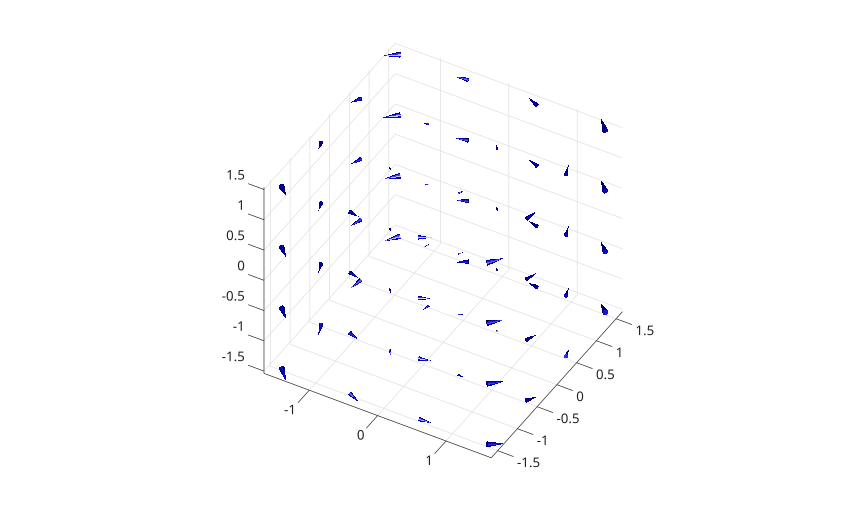

# coneplot

Display 3-D vector directions with cone-style arrows.

## 📝 Syntax

- coneplot(X, Y, Z, U, V, W)
- coneplot(X, Y, Z, U, V, W, cx, cy, cz)
- coneplot(parent, ...)
- h = coneplot(...)

## 📄 Description

<b>coneplot</b> displays sampled 3-D vector directions using a patch object.

## 💡 Example

Display vectors on a 3-D grid.

```matlab
% 3-D grid
[x, y, z] = meshgrid(-2:0.5:2, -2:0.5:2, -2:0.5:2);

% Synthetic vector field (rotation + divergence)
u = -y;
v = x;
w = z * 0.2;

% Cone positions
[cx, cy, cz] = meshgrid(-1.5:1:1.5, -1.5:1:1.5, -1.5:1:1.5);

figure
hcone = coneplot(x, y, z, u, v, w, cx, cy, cz, 0.4);
hcone.FaceColor = 'blue';
hcone.EdgeColor = 'none';

camlight right
lighting gouraud
view(30, 40)
daspect([1 1 1])
axis tight
grid on
```



## 🔗 See also

[quiver3](../../../graphics/1_plots/5_vector_fields/quiver3.md).
