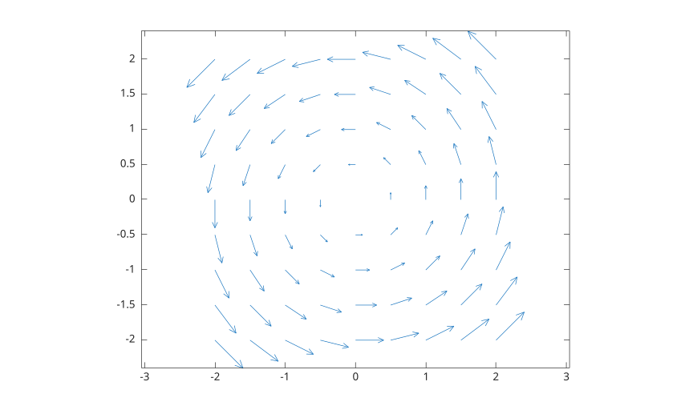
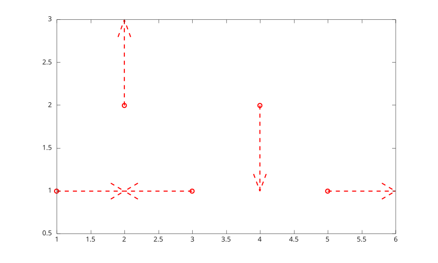

# quiver

2-D vector field plot.

## 📝 Syntax

- quiver(U, V)
- quiver(X, Y, U, V)
- quiver(..., scale)
- quiver(..., LineSpec)
- quiver(..., propertyName, propertyValue)
- quiver(parent, ...)
- h = quiver(...)

## 📥 Input argument

- X, Y - Arrow base coordinates, specified as scalars, vectors, or matrices.
- U, V - Vector components, specified as numeric arrays of the same size.
- scale - Automatic scale factor. Use 0 to disable automatic scaling.
- LineSpec - Line style, marker, and color specification.
- parent - Axes or hggroup parent.
- propertyName - Scalar string or character vector property name.
- propertyValue - Property value.

## 📤 Output argument

- h - Quiver graphics object.

## 📄 Description


<b>quiver(U,V)</b> plots arrows with vector components <b>U</b> and <b>V</b> on a regular grid. 

<b>quiver(X,Y,U,V)</b> plots arrows at the coordinates specified by <b>X</b> and <b>Y</b>. 

See [quiver properties](../../../graphics/2_graphics_objects/4_properties/nelson.graphics.quiver.properties.md) for the complete property list.

## 💡 Examples

Plot a vector field on a regular grid.

```matlab
[X, Y] = meshgrid(-2:0.5:2, -2:0.5:2);
U = -Y;
V = X;
h = quiver(X, Y, U, V);
axis equal
```

Style the arrows and disable automatic scaling.

```matlab
x = 1:5;
y = [1 2 1 2 1];
u = [1 0 -1 0 1];
v = [0 1 0 -1 0];
h = quiver(x, y, u, v, 0, 'r--o', 'LineWidth', 1.5);
h.ShowArrowHead = 'on';
```



## 🔗 See also

[quiver properties](../../../graphics/2_graphics_objects/4_properties/nelson.graphics.quiver.properties.md), [meshgrid](../../../elementary_functions/1_array_creation_shape/meshgrid.md), [quiver3](../../../graphics/1_plots/5_vector_fields/quiver3.md), [plot](../../../graphics/1_plots/1_line_plots/plot.md).

## 🕔 History

| Version | 📄 Description     |
| ------- | --------------- |
| 1.0.0   | initial version |
| 2.0.0   | native quiver graphics object |

<!--
## 👤 Author

Allan CORNET
-->
