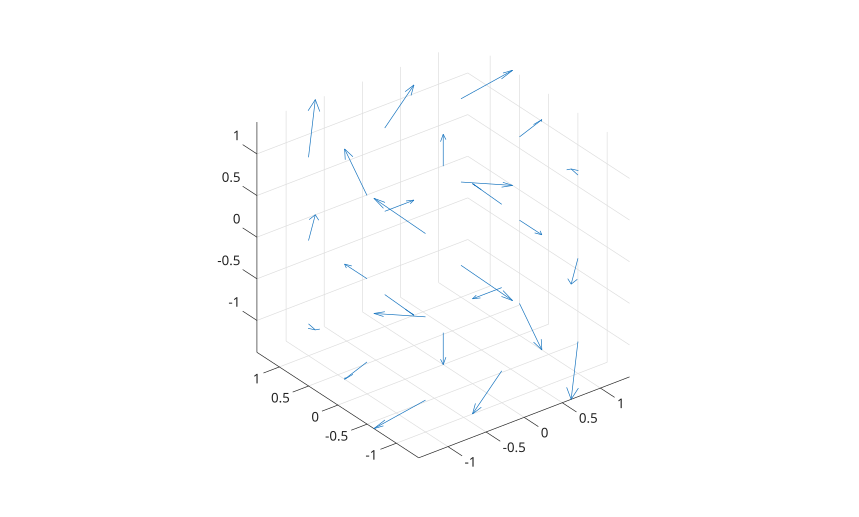

# quiver3

3-D vector field plot.

## 📝 Syntax

- quiver3(Z, U, V, W)
- quiver3(X, Y, Z, U, V, W)
- quiver3(..., scale)
- quiver3(..., LineSpec)
- quiver3(..., propertyName, propertyValue)
- quiver3(parent, ...)
- h = quiver3(...)

## 📥 Input argument

- X, Y, Z - Arrow base coordinates, specified as scalars, vectors, matrices, or arrays that match the vector component size.
- U, V, W - Vector components, specified as numeric arrays of the same size.
- scale - Automatic scale factor. Use 0 to disable automatic scaling.
- LineSpec - Line style, marker, and color specification.
- parent - Axes or hggroup parent.
- propertyName - Scalar string or character vector property name.
- propertyValue - Property value.

## 📤 Output argument

- h - Quiver graphics object.

## 📄 Description


<b>quiver3(Z,U,V,W)</b> plots 3-D arrows on a regular x-y grid using <b>Z</b> as the z-coordinate data. 

<b>quiver3(X,Y,Z,U,V,W)</b> plots arrows at the coordinates specified by <b>X</b>, <b>Y</b>, and <b>Z</b>. 

The returned object has type <b>quiver</b>. Its public properties include <b>XData</b>, <b>YData</b>, <b>ZData</b>, <b>UData</b>, <b>VData</b>, <b>WData</b>, <b>AutoScale</b>, <b>AutoScaleFactor</b>, <b>ScaleFactor</b>, <b>Color</b>, <b>LineStyle</b>, <b>LineWidth</b>, <b>Marker</b>, <b>MarkerSize</b>, <b>MaxHeadSize</b>, <b>ShowArrowHead</b>, <b>Alignment</b>, <b>DisplayName</b>, and common graphics interaction properties.

## 💡 Examples

Plot a 3-D vector field.

```matlab
[x, y, z] = meshgrid(-1:1, -1:1, -1:1);
u = y;
v = -x;
w = z;
quiver3(x, y, z, u, v, w);
axis equal
```

Disable automatic scaling and style the arrows.

```matlab
x = [0 1 2];
y = [0 1 0];
z = [0 0 1];
u = [1 0 -1];
v = [0 1 0];
w = [0.5 0.5 1];
h = quiver3(x, y, z, u, v, w, 0, 'r--o');
h.LineWidth = 1.5;
```
Plot surface normals as 3-D arrows.

```matlab
[X,Y] = meshgrid(-2:0.25:2,-1:0.2:1);
Z = X.*exp(-X.^2 - Y.^2);
[U,V,W] = surfnorm(X,Y,Z);
quiver3(X,Y,Z,U,V,W)
hold on
surf(X,Y,Z)
axis equal
```


## 🔗 See also

[quiver](../../../graphics/1_plots/5_vector_fields/quiver.md), [plot3](../../../graphics/1_plots/1_line_plots/plot3.md), [meshgrid](../../../elementary_functions/1_array_creation_shape/meshgrid.md).

## 🕔 History

| Version | 📄 Description     |
| ------- | --------------- |
| 2.0.0   | native quiver graphics object |

<!--
## 👤 Author

Allan CORNET
-->
