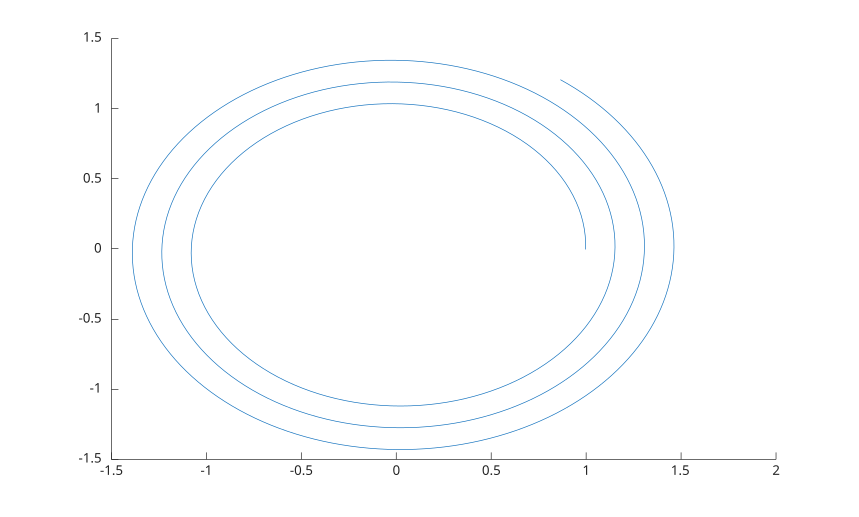

# stream3

Compute 3-D streamline vertices from vector field data.

## 📝 Syntax

- vertices = stream3(U, V, W, startx, starty, startz)
- vertices = stream3(X, Y, Z, U, V, W, startx, starty, startz)
- vertices = stream3(..., options)

## 📄 Description


<b>stream3</b> follows a 3-D vector field from each start point and returns the vertices it passed through. Nothing is drawn: hand the result to <b>streamline</b> to see it. 

The result is a cell array with one entry per start point, each an N-by-3 array of <b>[x, y, z]</b> coordinates whose first row is the start point itself. A start point outside the field gives an empty entry; a start point the field does not move keeps its single vertex. 

Without <b>X</b>, <b>Y</b> and <b>Z</b> the field is indexed from 1. 

The optional <b>options</b> input is <b>[stepsize]</b> or <b>[stepsize, maxvert]</b>. <b>stepsize</b> is counted in grid cells and defaults to 0.1. <b>maxvert</b> is the largest number of vertices to produce, the start point counted in, and defaults to 500.

## 💡 Example

Trace a rising spiral through a rotating field.

```matlab
[x, y, z] = meshgrid(-2:0.5:2, -2:0.5:2, -2:0.5:2);
vertices = stream3(x, y, z, -y, x, 0.2 * ones(size(x)), 1, 0, -2);
streamline(vertices);
```



## 🔗 See also

[stream2](../../../graphics/1_plots/5_vector_fields/stream2.md), [streamline](../../../graphics/1_plots/5_vector_fields/streamline.md), [coneplot](../../../graphics/1_plots/5_vector_fields/coneplot.md).