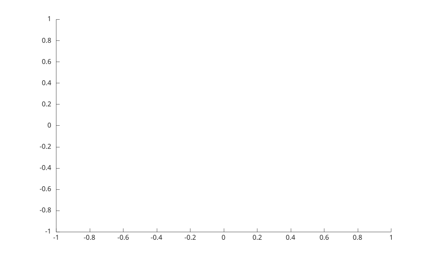

# streamline

Display streamlines from vector field data.

## 📝 Syntax

- streamline(U, V, sx, sy)
- streamline(vertices)
- streamline(X, Y, U, V, sx, sy)
- streamline(X, Y, Z, U, V, W, sx, sy, sz)
- streamline(..., options)
- streamline(parent, ...)
- h = streamline(...)

## 📄 Description


<b>streamline</b> traces paths through 2-D or 3-D vector fields from the supplied start points. 

<b>streamline(vertices)</b> draws precomputed streamline vertices supplied as a cell array. Each cell contains an N-by-2 or N-by-3 numeric array. 

The optional <b>options</b> input is <b>[stepsize]</b> or <b>[stepsize, maxvert]</b>. <b>stepsize</b> is counted in grid cells and defaults to 0.1. <b>maxvert</b> is the largest number of vertices to produce, the start point counted in, and defaults to 500.

## 💡 Example

Trace a 2-D streamline.

```matlab
[x, y] = meshgrid(-2:2, -2:2);
streamline(x, y, -y, x, 0, 0);
```



## 🔗 See also

[stream2](../../../graphics/1_plots/5_vector_fields/stream2.md), [stream3](../../../graphics/1_plots/5_vector_fields/stream3.md), [streamslice](../../../graphics/1_plots/5_vector_fields/streamslice.md), [quiver](../../../graphics/1_plots/5_vector_fields/quiver.md).