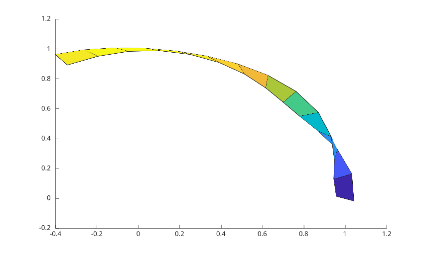

# streamribbon

Display stream paths with ribbon-like line styling.

## 📝 Syntax

- streamribbon(U, V, W, sx, sy, sz)
- streamribbon(X, Y, Z, U, V, W, sx, sy, sz)
- streamribbon(vertices, twistangle)
- streamribbon(..., width)
- h = streamribbon(...)

## 📄 Description


<b>streamribbon</b> displays 3-D stream paths as ribbon surfaces. 

<b>streamribbon(vertices, twistangle)</b> uses precomputed streamline vertices and a cell array of twist angles. The returned handles are surface objects.

## 💡 Example

Display a stream ribbon style path.

```matlab
t = 0:.15:2;
vertices = {[cos(t)' sin(t)' t']};
twistangle = {cos(t)'};
streamribbon(vertices, twistangle);
```



## 🔗 See also

[streamline](../../../graphics/1_plots/5_vector_fields/streamline.md), [streamtube](../../../graphics/1_plots/5_vector_fields/streamtube.md).