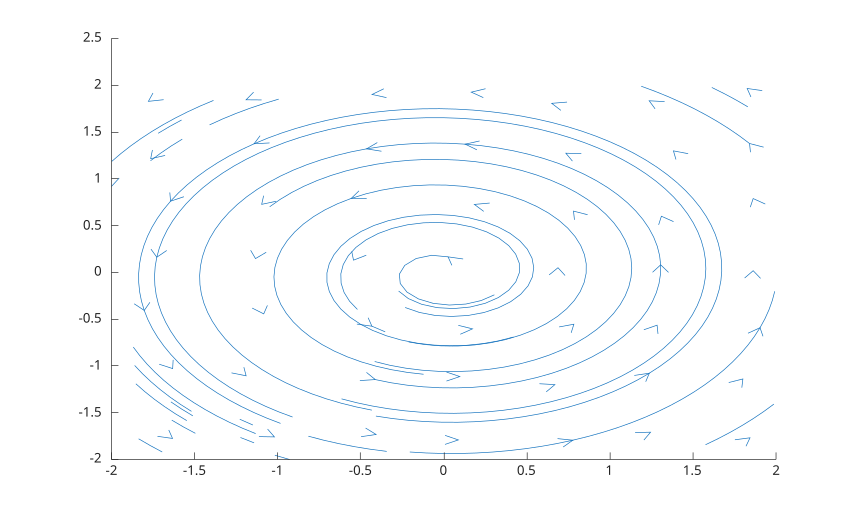

# streamslice

Display vector field direction on a slice or plane.

## 📝 Syntax

- streamslice(U, V)
- streamslice(X, Y, U, V)
- streamslice(X, Y, Z, U, V, W, sx, sy, sz)
- streamslice(parent, ...)
- h = streamslice(...)
- [vertices, arrowVertices] = streamslice(...)

## 📄 Description

<b>streamslice</b> displays vector field direction using line objects for stream paths and direction arrows.

With two outputs, <b>streamslice</b> returns cell arrays of streamline vertices and arrow vertices instead of drawing.

## 💡 Example

Display direction in a 2-D field.

```matlab
[x, y] = meshgrid(-2:2, -2:2);
streamslice(x, y, -y, x);
```



## 🔗 See also

[streamline](../../../graphics/1_plots/5_vector_fields/streamline.md), [quiver](../../../graphics/1_plots/5_vector_fields/quiver.md).
