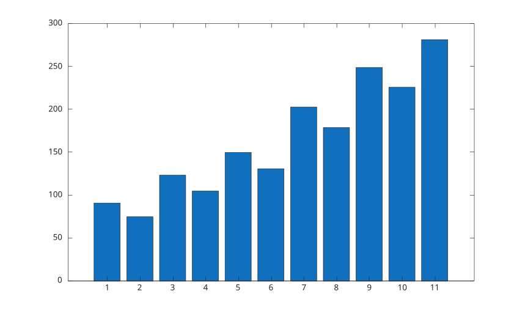
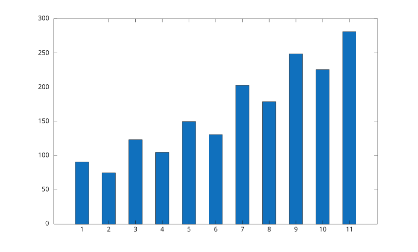
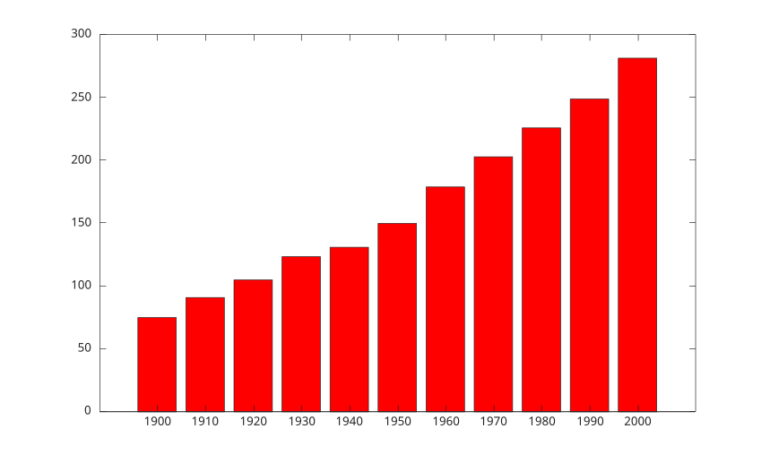
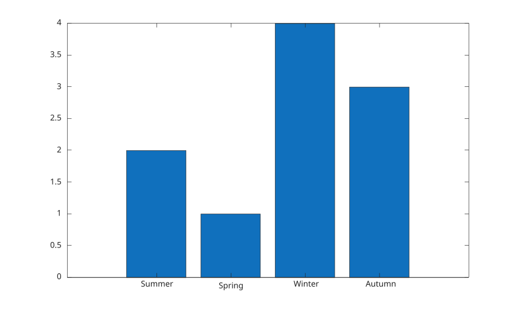
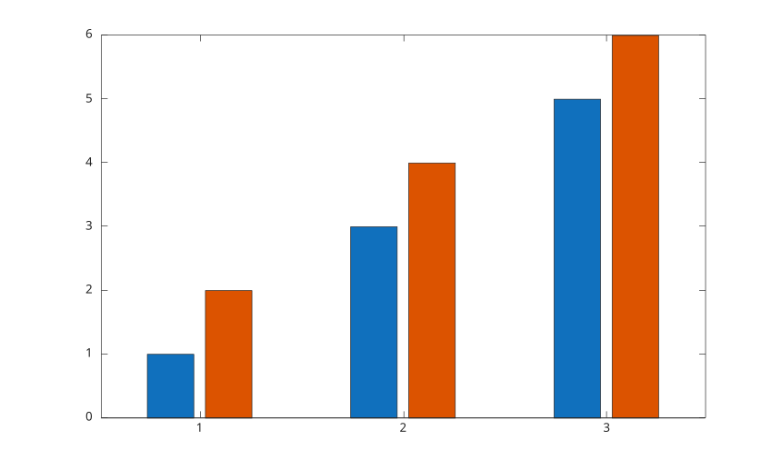
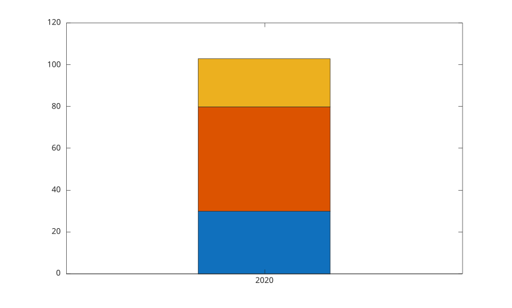
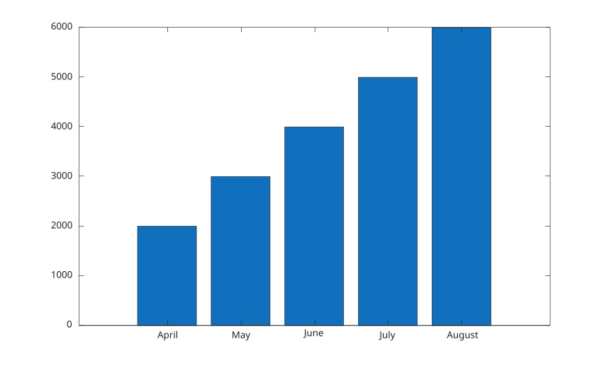

# bar

Bar graph.

## 📝 Syntax

- bar(Y)
- bar(X, Y)
- bar(..., width)
- bar(..., color)
- bar(..., 'grouped')
- bar(..., 'stacked')
- bar(..., propertyName, propertyValue)
- bar(ax, ...)
- b = bar(...)

## 📥 Input argument

- X - x-coordinates: scalar, vector, categorical array, string array, or cell array of labels.
- Y - y-coordinates: vector or matrix.
- width - scalar, 0.8 (default).
- color - a scalar string or row vector character: color name or short color name.
- propertyName - a scalar string or row vector character.
- propertyValue - a value.
- ax - Axes object.

## 📤 Output argument

- b - bar graphics object or vector of bar graphics objects.

## 📄 Description

<b>bar(X, Y)</b> creates a bar graph using X positions and Y values.

When only one argument is provided, <b>bar(Y)</b> generates X positions from 1 to the number of rows in Y.

You can optionally specify the width of the bars. A value of 1.0 makes each bar touch its neighboring bars, while the default width is 0.8.

When Y is a matrix, <b>bar</b> creates grouped bars by default. Use <b>'stacked'</b> to stack columns in each group.

When X is a categorical array, the bars are placed in category order (as returned by <b>categories</b>), Y is reordered to match, and the category names are used as tick labels.

See [bar properties](../../../graphics/2_graphics_objects/4_properties/nelson.graphics.bar.properties.md) for the complete property list.

## 💡 Examples

Bar graph from a vector.

```matlab
f = figure();
y = [91 75 123.5 105 150 131 203 179 249 226 281.5];
bar(y);

```


Bar graph with narrower bars.

```matlab
f = figure();
y = [91 75 123.5 105 150 131 203 179 249 226 281.5];
bar(y, 0.5);

```


Bar graph with explicit positions and a color.

```matlab
f = figure();
x = 1900:10:2000;
y = [75 91 105 123.5 131 150 179 203 226 249 281.5];
bar(x, y, 'r');

```


Bar graph with string labels.

```matlab
f = figure();
x = ["Summer", "Spring", "Winter", "Autumn"];
y = [2 1 4 3];
bar(x, y);

```


Bar graph with face and edge properties.

```matlab
f = figure();
y = [91 75 123.5 105 150 131 203 179 249 226 281.5];
bar(y, 'FaceColor', [0 .5 .5], 'EdgeColor', [0 .9 .9], 'LineWidth', 1.5);

```


Grouped bars.

```matlab
f = figure();
y = [1 2; 3 4; 5 6];
bar(y, 'grouped');

```


Stacked bars with positive and negative values.

```matlab
f = figure();
y = [1 -2 3; -4 5 -6];
bar(y, 'stacked');

```


Stacked bars at a scalar position.

```matlab
f = figure();
x = 2020;
y = [30 50 23];
bar(x, y, "stacked");

```


Bar graph with categorical labels.

```matlab
f = figure();
X = categorical({'Small', 'Medium', 'Large', 'Extra Large'});
X = reordercats(X, {'Small', 'Medium', 'Large', 'Extra Large'});
Y = [10 21 33 52];
bar(X, Y);

```


Bar graph from a table variable.

```matlab
f = figure();
Month = ["April"; "May"; "June"; "July"; "August"];
Sales = [2000; 3000; 4000; 5000; 6000];
Revenue = [1500; 1800; 2000; 3000; 4000];
tbl = table(Month, Sales, Revenue);
bar(tbl.Month, tbl.Sales);

```


Grouped bars from several table variables.

```matlab
f = figure();
Month = ["April"; "May"; "June"; "July"; "August"];
Sales = [2000; 3000; 4000; 5000; 6000];
Revenue = [1500; 1800; 2000; 3000; 4000];
tbl = table(Month, Sales, Revenue);
bar(tbl.Month, [tbl.Sales, tbl.Revenue]);
legend({'Sales', 'Revenue'}, 'Location', 'northwest');

```


## 🔗 See also

[bar properties](../../../graphics/2_graphics_objects/4_properties/nelson.graphics.bar.properties.md), [hist](../../../graphics/1_plots/4_data_distribution_plots/hist.md), [barh](../../../graphics/1_plots/6_discrete_data_plots/barh.md), [bar3](../../../graphics/1_plots/6_discrete_data_plots/bar3.md).

## 🕔 History

| Version | 📄 Description                          |
| ------- | --------------------------------------- |
| 1.0.0   | initial version                         |
| 1.12.0  | Color name or short color name managed. |

<!--
## 👤 Author

Allan CORNET
-->
