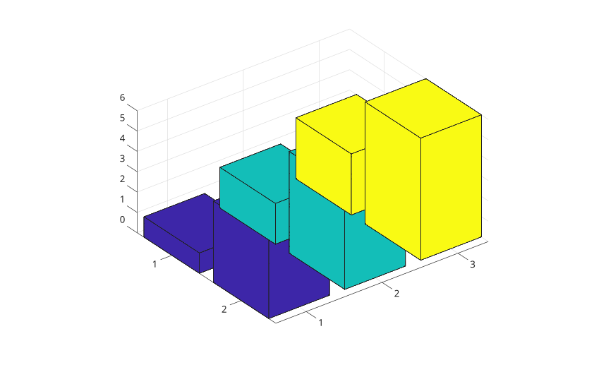
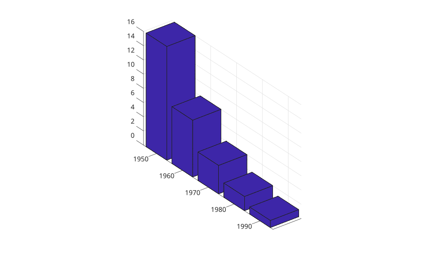
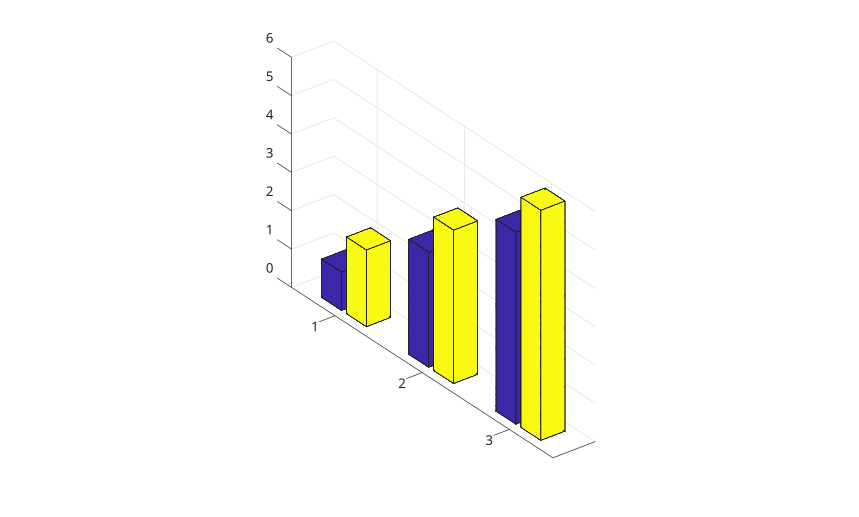
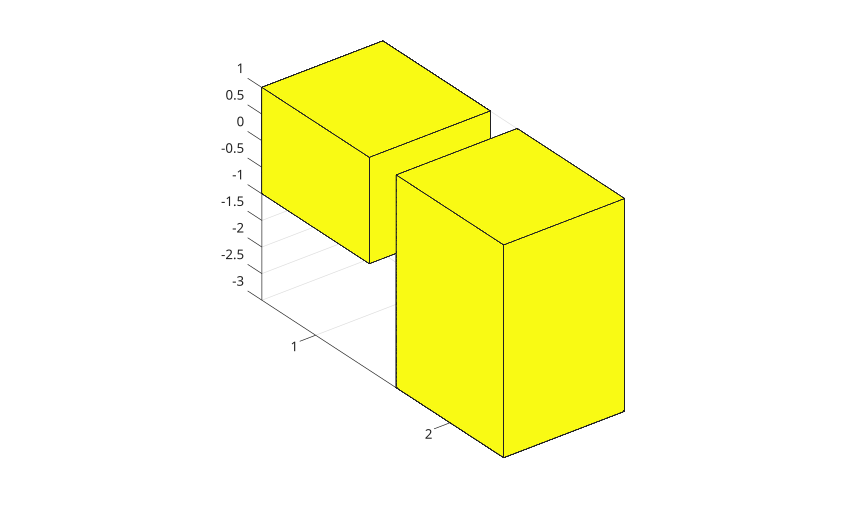

# bar3

Display a 3-D vertical bar chart.

## 📝 Syntax

- bar3(Y)
- bar3(Z, Y)
- bar3(..., width)
- bar3(..., 'detached')
- bar3(..., 'grouped')
- bar3(..., 'stacked')
- bar3(..., color)
- bar3(parent, ...)
- h = bar3(...)

## 📥 Input argument

- Y - Numeric vector or matrix of bar heights.
- Z - row positions for the bars.
- width - Relative bar width. The default value is 0.8.
- color - color name or short color name for the bar faces.

## 📤 Output argument

- h - surface graphics object or vector of surface graphics objects.

## 📄 Description


<b>bar3</b> displays columns as 3-D cuboids. Matrix columns are shown along the x direction and matrix rows along the y direction. 

Use <b>'grouped'</b> to group matrix columns at each row position and <b>'stacked'</b> to stack matrix columns at each row position.

## 💡 Examples

Detached 3-D bars from a matrix.

```matlab
f = figure();
Y = [1 2 3; 4 5 6];
bar3(Y);

```

3-D bars from a vector.

```matlab
f = figure();
z = [50 40 30 20 10];
bar3(z);

```

3-D bars with explicit row positions.

```matlab
f = figure();
z = [1950 1960 1970 1980 1990];
y = [16 8 4 2 1];
bar3(z, y);

```

Grouped 3-D bars.

```matlab
f = figure();
y = [1 2; 3 4; 5 6];
bar3(y, 'grouped');

```

Stacked 3-D bars with positive and negative values.

```matlab
f = figure();
y = [1 -2; -3 4];
bar3(y, 'stacked');

```

Set color and transparency.

```matlab
f = figure();
h = bar3(peaks(5), 0.6);
set(h, 'FaceColor', [0.2 0.5 0.8], 'FaceAlpha', 0.8);

```


## 🔗 See also

[bar](../../../graphics/1_plots/6_discrete_data_plots/bar.md), [bar3h](../../../graphics/1_plots/6_discrete_data_plots/bar3h.md), [surface](../../../graphics/1_plots/7_surfaces_volumes_polygons/surface.md).