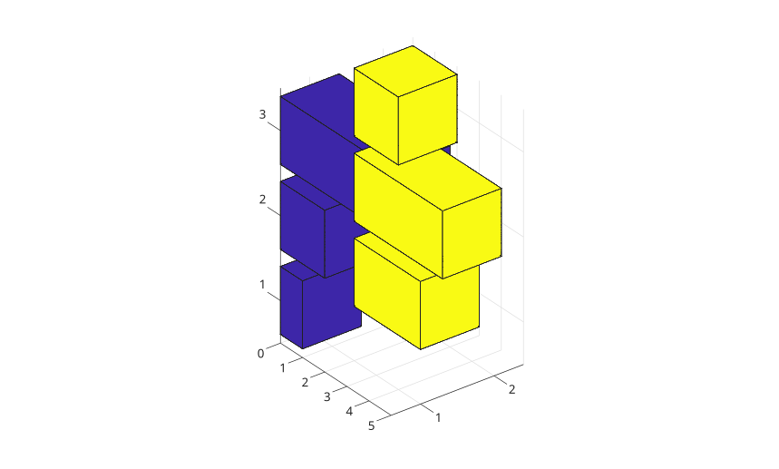
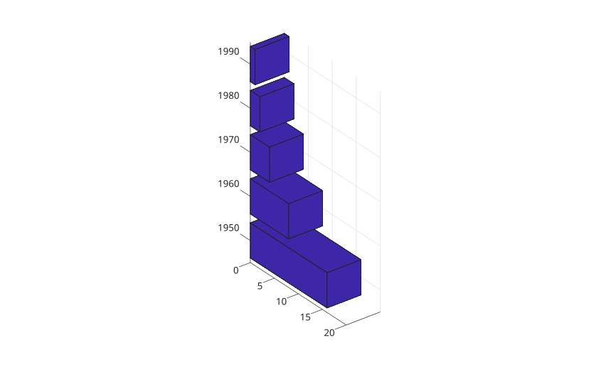
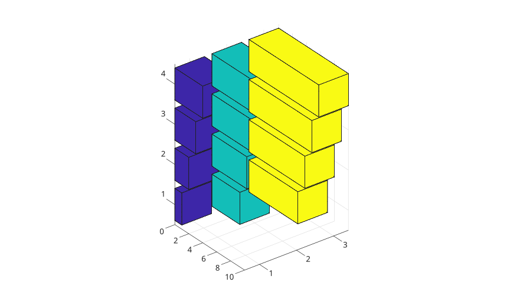

# bar3h

Display a 3-D horizontal bar chart.

## 📝 Syntax

- bar3h(Y)
- bar3h(Z, Y)
- bar3h(..., width)
- bar3h(..., 'detached')
- bar3h(..., 'grouped')
- bar3h(..., 'stacked')
- bar3h(..., color)
- bar3h(parent, ...)
- h = bar3h(...)

## 📥 Input argument

- Y - Numeric vector or matrix of bar lengths.
- Z - row positions for the bars.
- width - Relative bar width. The default value is 0.8.
- color - color name or short color name for the bar faces.

## 📤 Output argument

- h - surface graphics object or vector of surface graphics objects.

## 📄 Description

<b>bar3h</b> displays horizontal 3-D bars extending from x = 0.

Use <b>'grouped'</b> to group matrix columns at each row position and <b>'stacked'</b> to stack matrix columns at each row position.

## 💡 Examples

Detached horizontal 3-D bars from a matrix.

```matlab
f = figure();
Y = [1 3; 2 4; 5 2];
bar3h(Y);

```


Horizontal 3-D bars from a vector.

```matlab
f = figure();
y = [50 40 30 20 10];
bar3h(y);

```


Horizontal 3-D bars with explicit row positions.

```matlab
f = figure();
z = [1950 1960 1970 1980 1990];
y = [16 8 4 2 1];
bar3h(z, y);

```


Horizontal 3-D bars from a matrix.

```matlab
f = figure();
y = [1 4 7; 2 5 8; 3 6 9; 4 7 10];
bar3h(y);

```


Horizontal 3-D bars from a matrix with explicit row positions.

```matlab
f = figure();
z = [1 2 3 4];
y = [1 5 9; 2 6 10; 3 7 11; 4 8 12];
bar3h(z, y);

```


Horizontal 3-D bars with width and a color.

```matlab
f = figure();
z = 0:pi/16:pi;
y = [sin(z') / 4, sin(z') / 2, sin(z')];
bar3h(z, y, 1, "r");

```


Grouped horizontal 3-D bars.

```matlab
f = figure();
y = [1 2; 3 4; 5 6];
bar3h(y, 'grouped');

```


Stacked horizontal 3-D bars with positive and negative values.

```matlab
f = figure();
y = [1 -2; -3 4];
bar3h(y, 'stacked');

```


## 🔗 See also

[barh](../../../graphics/1_plots/6_discrete_data_plots/barh.md), [bar3](../../../graphics/1_plots/6_discrete_data_plots/bar3.md), [surface](../../../graphics/1_plots/7_surfaces_volumes_polygons/surface.md).
