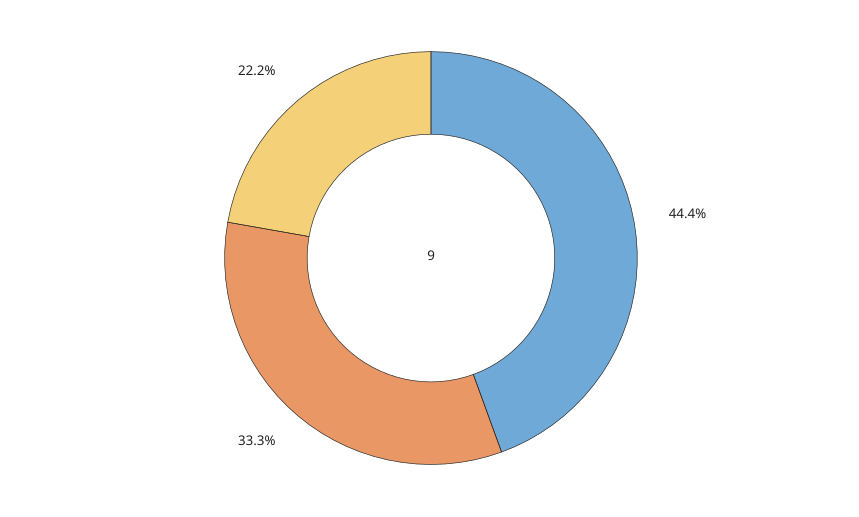

# donutchart

Donut chart object.

## 📝 Syntax

- donutchart(data)
- donutchart(data, names)
- donutchart(fig, ...)
- donutchart(..., propertyName, propertyValue)
- d = donutchart(...)

## 📥 Input argument

- data - Numeric vector of wedge values.
- names - String array, character vector, or cell array of character vectors used as wedge names.
- fig - Figure parent.
- propertyName - Donut chart property name.
- propertyValue - Value assigned to the named property.

## 📤 Output argument

- d - Donut chart graphics object.

## 📄 Description


<b>donutchart(data)</b> creates one donut chart object in the current figure. 

<b>InnerRadius</b> controls the hole radius as a fraction of the outer radius. <b>CenterLabel</b> draws text in the center of the hole. 

See [donutchart properties](../../../graphics/2_graphics_objects/4_properties/nelson.graphics.donutchart.properties.md) for the complete property list.

## 💡 Examples

Donut chart with a center label.

```matlab
figure('Color', [1 1 1]);
d = donutchart([4 3 2], ["A", "B", "C"], 'CenterLabel', '9');
```

Custom inner radius and colors.

```matlab
figure('Color', [1 1 1]);
d = donutchart([5 4 3 2], 'InnerRadius', 0.35, 'FaceAlpha', 0.75, ...
  'ColorOrder', [0.8 0.2 0.2; 0.2 0.7 0.3; 0.2 0.4 0.8]);
```


## 🔗 See also

[donutchart properties](../../../graphics/2_graphics_objects/4_properties/nelson.graphics.donutchart.properties.md), [piechart](../../../graphics/1_plots/6_discrete_data_plots/piechart.md), [pie](../../../graphics/1_plots/6_discrete_data_plots/pie.md).

## 🕔 History

| Version | 📄 Description     |
| ------- | --------------- |
| 2.0.0   | initial version |

<!--
## 👤 Author

Allan CORNET
-->
