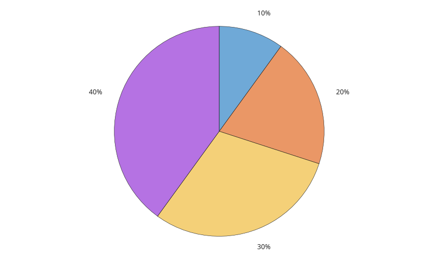

# piechart

Pie chart object.

## 📝 Syntax

- piechart(data)
- piechart(data, names)
- piechart(fig, ...)
- piechart(..., propertyName, propertyValue)
- p = piechart(...)

## 📥 Input argument

- data - Numeric vector of wedge values. Negative, infinite, and NaN values are ignored for display.
- names - String array, character vector, or cell array of character vectors used as wedge names.
- fig - Figure parent.
- propertyName - Pie chart property name.
- propertyValue - Value assigned to the named property.

## 📤 Output argument

- p - Pie chart graphics object.

## 📄 Description

<b>piechart(data)</b> creates one pie chart object in the current figure.

<b>FaceColor</b> can be <b>flat</b>, <b>none</b>, or an RGB color. <b>FaceAlpha</b>, <b>EdgeColor</b>, and <b>LineWidth</b> affect the rendered wedges. <b>Proportions</b>, <b>CategoryCounts</b>, <b>WedgeDisplayData</b>, and <b>WedgeDisplayNames</b> are read-only derived properties.

See [piechart properties](../../../graphics/2_graphics_objects/4_properties/nelson.graphics.piechart.properties.md) for the complete property list.

## 💡 Examples

Pie chart with default percent labels.

```matlab
figure('Color', [1 1 1]);
p = piechart([1 2 3 4]);
```


Named wedges with a legend.

```matlab
figure('Color', [1 1 1]);
p = piechart([4 3 2], ["A", "B", "C"], 'LegendVisible', 'on', ...
  'LegendTitle', 'Names', 'FaceAlpha', 0.7);
```


Wireframe wedges.

```matlab
figure('Color', [1 1 1]);
p = piechart([3 2 1], 'FaceColor', 'none', 'EdgeColor', [0 0 0], ...
  'LineWidth', 2);
```


## 🔗 See also

[piechart properties](../../../graphics/2_graphics_objects/4_properties/nelson.graphics.piechart.properties.md), [donutchart](../../../graphics/1_plots/6_discrete_data_plots/donutchart.md), [pie](../../../graphics/1_plots/6_discrete_data_plots/pie.md).

## 🕔 History

| Version | 📄 Description  |
| ------- | --------------- |
| 2.0.0   | initial version |

<!--
## 👤 Author

Allan CORNET
-->
