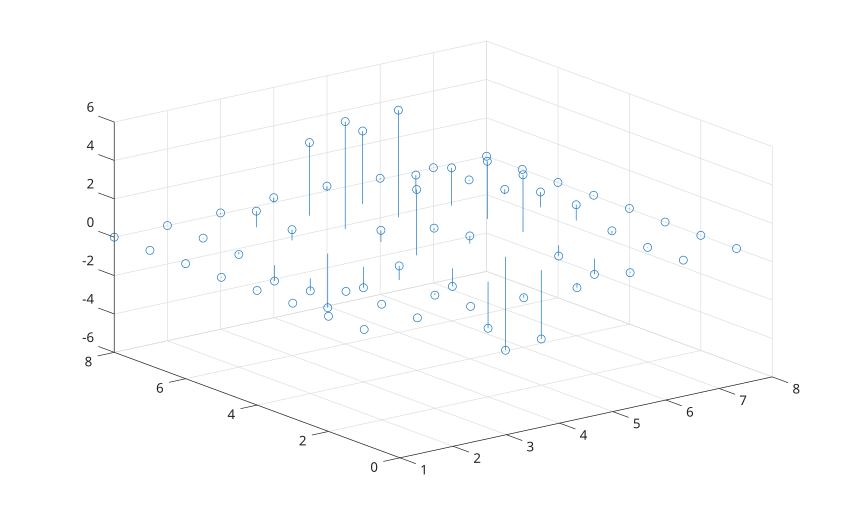

# stem3

Display 3-D stem plot.

## 📝 Syntax

- stem3(Z)
- stem3(X, Y, Z)
- stem3(..., LineSpec)
- stem3(..., 'filled')
- stem3(parent, ...)
- h = stem3(...)

## 📥 Input argument

- Z - Stem heights: numeric vector or matrix.
- X - X coordinates: numeric vector or matrix.
- Y - Y coordinates: numeric vector or matrix.
- LineSpec - Line style, marker, and color specification.
- parent - Axes or hggroup parent.

## 📤 Output argument

- h - Stem graphics object.

## 📄 Description


<b>stem3</b> displays vertical stems from z = 0 to the values in <b>Z</b>, with markers at the stem tips. 

The returned object is a <b>stem</b> graphics object. See [nelson.graphics.stem.properties](../../../graphics/2_graphics_objects/4_properties/nelson.graphics.stem.properties.md) for supported properties.

## 💡 Examples

Display a 3-D stem plot from a matrix.

```matlab
Z = peaks(8);
stem3(Z);
```

Specify coordinates and fill markers.

```matlab
t = 0:0.2:2*pi;
stem3(cos(t), sin(t), t, 'r--', 'filled');
```


## 🔗 See also

[stem](../../../graphics/1_plots/6_discrete_data_plots/stem.md), [plot3](../../../graphics/1_plots/1_line_plots/plot3.md), [nelson.graphics.stem.properties](../../../graphics/2_graphics_objects/4_properties/nelson.graphics.stem.properties.md).