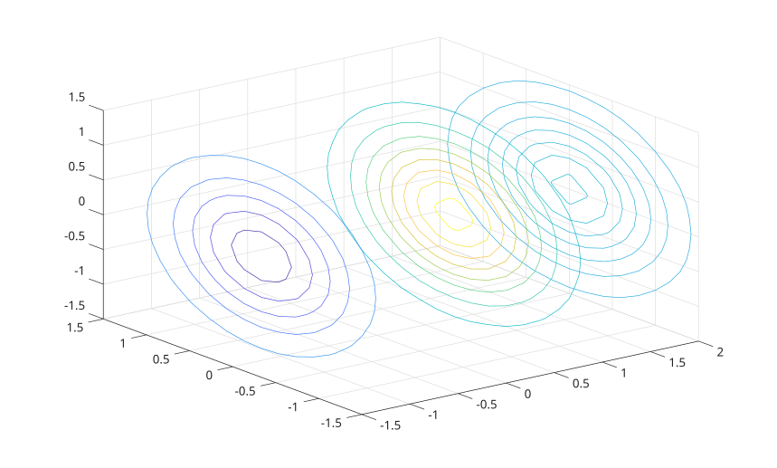
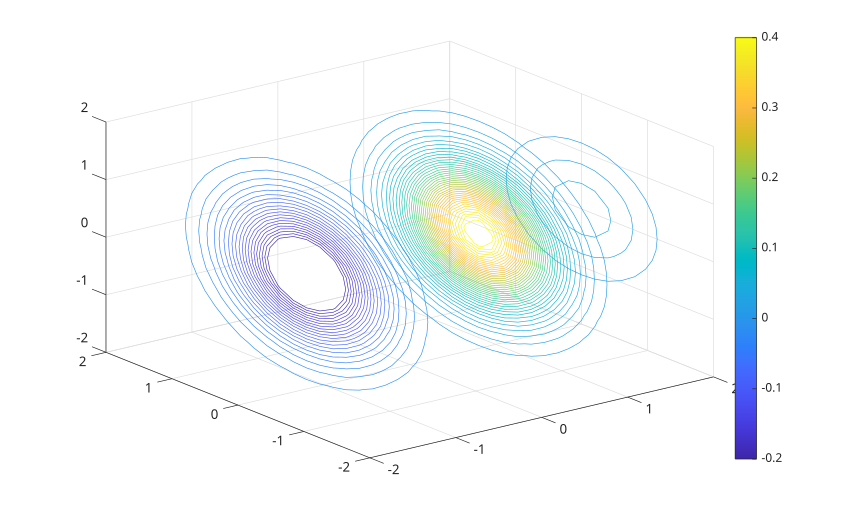
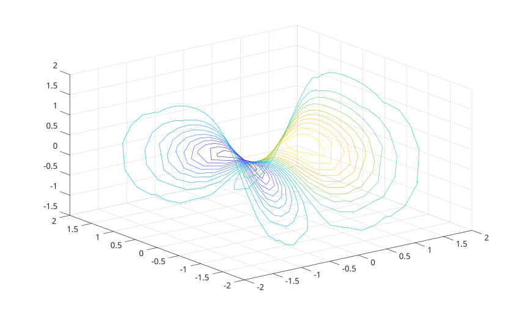

# contourslice

Display contour lines on slices through volume data.

## 📝 Syntax

- contourslice(V, xs, ys, zs)
- contourslice(V, XI, YI, ZI)
- contourslice(X, Y, Z, V, xs, ys, zs)
- contourslice(X, Y, Z, V, XI, YI, ZI)
- contourslice(..., levels)
- contourslice(..., method)
- contourslice(parent, ...)
- h = contourslice(...)

## 📄 Description

<b>contourslice</b> computes contour lines on selected volume slices and returns a column vector of patch objects.

The <b>levels</b> input can be a scalar number of contour levels or a vector of contour values. A slice value equal to <b>NaN</b> selects all slices along that direction.

When <b>XI</b>, <b>YI</b>, and <b>ZI</b> are matrices, contours are drawn along the surface defined by those matrices.

The optional <b>method</b> input can be <b>'nearest'</b>, <b>'linear'</b>, or <b>'cubic'</b>. The default method for axis-aligned slices is <b>'nearest'</b>; the default for surface slices is <b>'linear'</b>.

## 💡 Examples

Display contours in several slice planes.

```matlab
[X, Y, Z] = meshgrid(-2:.2:2);
V = X .* exp(-X.^2 - Y.^2 - Z.^2);
xslice = [-1.2, 0.8, 2];
yslice = [];
zslice = [];
contourslice(X, Y, Z, V, xslice, yslice, zslice);
view(3);
grid on;
```


Specify contour levels and add a colorbar.

```matlab
[X, Y, Z] = meshgrid(-2:.2:2);
V = X .* exp(-X.^2 - Y.^2 - Z.^2);
xslice = [-1.2, 0.8, 2];
levels = -0.2:0.01:0.4;
contourslice(X, Y, Z, V, xslice, [], [], levels);
colorbar;
view(3);
grid on;
```


Display contours on a surface slice.

```matlab
[X, Y, Z] = meshgrid(-5:0.2:5);
V = X .* exp(-X.^2 - Y.^2 - Z.^2);
[xsurf, ysurf] = meshgrid(-2:0.2:2);
zsurf = xsurf.^2 - ysurf.^2;
contourslice(X, Y, Z, V, xsurf, ysurf, zsurf, 20);
view(3);
grid on;
```



## 🔗 See also

[slice](../../../graphics/1_plots/7_surfaces_volumes_polygons/slice.md), [contour](../../../graphics/1_plots/3_contour_plots/contour.md).
