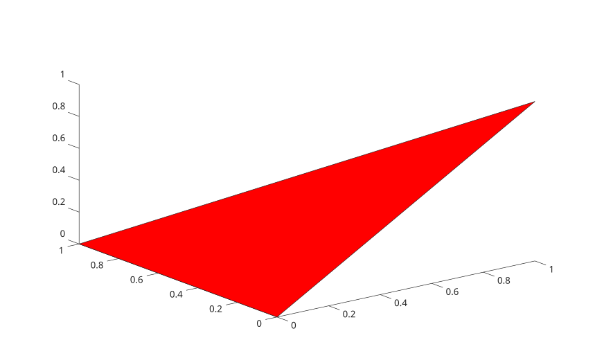

# fill3

Create filled 3-D patches.

## 📝 Syntax

- fill3(X, Y, Z, C)
- fill3(X1, Y1, Z1, C1, ..., Xn, Yn, Zn, Cn)
- fill3(..., propertyName, propertyValue)
- fill3(ax, ...)
- go = fill3(...)

## 📥 Input argument

- X - x-coordinates: vector or matrix.
- Y - y-coordinates: vector or matrix.
- Z - z-coordinates: vector or matrix.
- C - Color data or color specification.

## 📤 Output argument

- go - graphics object handles of patch type.

## 📄 Description


<b>fill3</b> creates filled polygons in 3-D coordinates. Each input group creates one or more patch objects and supports patch name-value properties.

## 💡 Example


```matlab
x = [0 1 0];
y = [0 0 1];
z = [0 1 0];
fill3(x, y, z, 'red');
view(3)
```



## 🔗 See also

[fill](../../../graphics/1_plots/7_surfaces_volumes_polygons/fill.md), [patch](../../../graphics/1_plots/7_surfaces_volumes_polygons/patch.md).
<!--
## 👤 Author

Allan CORNET
-->
