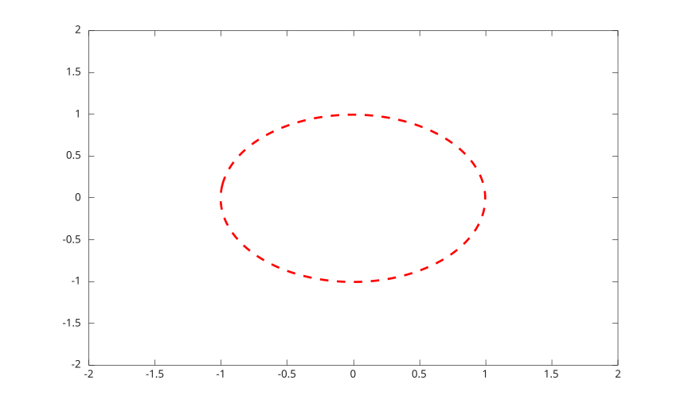
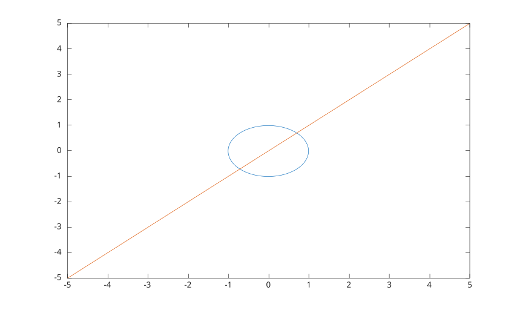

# fimplicit

Plot an implicit function curve.

## 📝 Syntax

- fimplicit(fun)
- fimplicit({fun1, fun2, ...})
- fimplicit(fun, interval)
- fimplicit(fun, [xmin xmax ymin ymax])
- fimplicit(..., LineSpec)
- fimplicit(..., propertyName, propertyValue)
- fimplicit(parent, ...)
- h = fimplicit(...)

## 📄 Description


<b>fimplicit</b> samples <b>fun(x,y)</b> and plots the zero contour as an <b>implicitfunctionline</b> graphics object. 

When a cell array of function handles is specified, one <b>implicitfunctionline</b> object is created for each function and the returned handle array is a column vector. 

See [implicitfunctionline properties](../../../graphics/2_graphics_objects/4_properties/nelson.graphics.implicitfunctionline.properties.md) for the complete property list.

## 💡 Examples

Plot a unit circle.

```matlab
fimplicit(@(x, y) x.^2 + y.^2 - 1, [-2 2 -2 2]);
```

Use a line specification and line properties.

```matlab
h = fimplicit(@(x, y) x.^2 + y.^2 - 1, [-2 2], '--r', 'LineWidth', 2);
```

Plot two implicit curves.

```matlab
f1 = @(x, y) x.^2 + y.^2 - 1;
f2 = @(x, y) x - y;
h = fimplicit({f1, f2});
```



## 🔗 See also

[implicitfunctionline properties](../../../graphics/2_graphics_objects/4_properties/nelson.graphics.implicitfunctionline.properties.md), [fcontour](../../../graphics/1_plots/3_contour_plots/fcontour.md), [contour](../../../graphics/1_plots/3_contour_plots/contour.md).