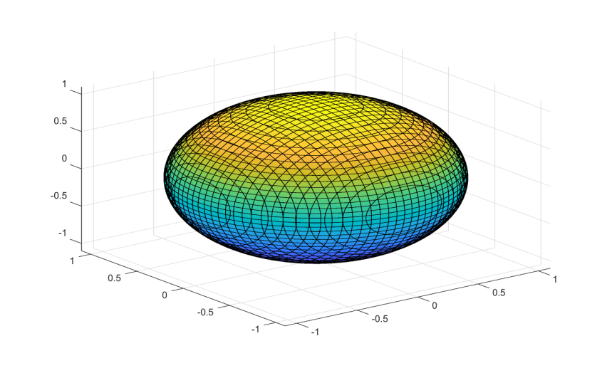

# fimplicit3

Plot an implicit 3-D function surface approximation.

## 📝 Syntax

- fimplicit3(fun)
- fimplicit3(fun, interval)
- fimplicit3(fun, [xmin xmax ymin ymax zmin zmax])
- fimplicit3(..., LineSpec)
- fimplicit3(..., propertyName, propertyValue)
- fimplicit3(parent, ...)
- h = fimplicit3(...)

## 📄 Description


<b>fimplicit3</b> samples <b>fun(x,y,z)</b> on a regular grid and displays an approximated zero-level surface as an <b>implicitfunctionsurface</b> graphics object. 

See [implicitfunctionsurface properties](../../../graphics/2_graphics_objects/4_properties/nelson.graphics.implicitfunctionsurface.properties.md) for the complete property list.

## 💡 Examples

Plot a sphere approximation.

```matlab
fimplicit3(@(x, y, z) x.^2 + y.^2 + z.^2 - 1, [-1.5 1.5]);
```

Use a line specification and surface properties.

```matlab
h = fimplicit3(@(x, y, z) x.^2 + y.^2 + z.^2 - 1, [-1.5 1.5], 'r', 'FaceAlpha', 0.5);
```


## 🔗 See also

[implicitfunctionsurface properties](../../../graphics/2_graphics_objects/4_properties/nelson.graphics.implicitfunctionsurface.properties.md), [fimplicit](../../../graphics/1_plots/7_surfaces_volumes_polygons/fimplicit.md).