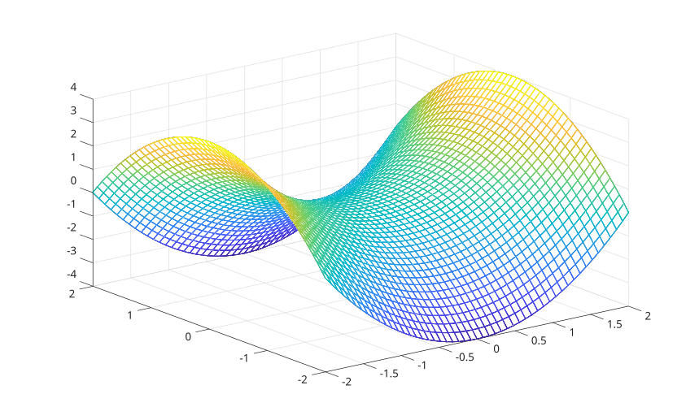

# fmesh

Plot a mesh from a function of two variables.

## 📝 Syntax

- fmesh(fun)
- fmesh(fun, xyinterval)
- fmesh(fun, [xmin xmax ymin ymax])
- fmesh(funx, funy, funz)
- fmesh(..., Name, Value)
- fmesh(parent, ...)
- h = fmesh(...)

## 📄 Description


<b>fmesh</b> creates a <b>functionsurface</b> graphics object and displays a mesh for a function of two variables. 

The function can be specified as <b>fun(x,y)</b>. A parametric surface can be specified with <b>funx(u,v)</b>, <b>funy(u,v)</b>, and <b>funz(u,v)</b>. 

The default range is <b>[-5 5 -5 5]</b>. A two-element interval applies to both x and y ranges. 

See [functionsurface properties](../../../graphics/2_graphics_objects/4_properties/nelson.graphics.functionsurface.properties.md) for the complete property list.

## 💡 Examples

Display a function mesh.

```matlab
fmesh(@(x, y) sin(x) + cos(y), [-pi pi -pi pi]);
```

Use a denser mesh and set a line property.

```matlab
fmesh(@(x, y) x.^2 - y.^2, [-2 2 -2 2], 'MeshDensity', 51, 'LineWidth', 1.5);
```

Display a parametric mesh.

```matlab
fmesh(@(u, v) u, @(u, v) v, @(u, v) sin(u) + cos(v), [-pi pi -pi pi]);
```


## 🔗 See also

[functionsurface properties](../../../graphics/2_graphics_objects/4_properties/nelson.graphics.functionsurface.properties.md), [mesh](../../../graphics/1_plots/7_surfaces_volumes_polygons/mesh.md), [fsurf](../../../graphics/1_plots/7_surfaces_volumes_polygons/fsurf.md).