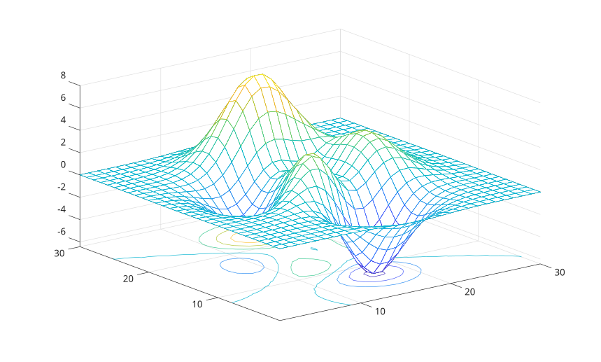

# meshc

Display a mesh with contour lines below it.

## 📝 Syntax

- meshc(Z)
- meshc(Z, C)
- meshc(X, Y, Z)
- meshc(X, Y, Z, C)
- meshc(parent, ...)
- meshc('Parent', parent, ...)
- h = meshc(...)

## 📄 Description


<b>meshc</b> displays a mesh and contour lines projected at the base of the mesh. 

The returned value is a two-element graphics vector containing the surface object followed by the contour object.

## 💡 Examples

Mesh with contours.

```matlab
meshc(peaks(30));
```

Use separate color data and a parent axes.

```matlab
f = figure();
ax = axes('Parent', f);
Z = peaks(20);
C = abs(Z);
meshc('Parent', ax, Z, C, 'LineWidth', 1.5);
```


## 🔗 See also

[mesh](../../../graphics/1_plots/7_surfaces_volumes_polygons/mesh.md), [contour3](../../../graphics/1_plots/3_contour_plots/contour3.md).