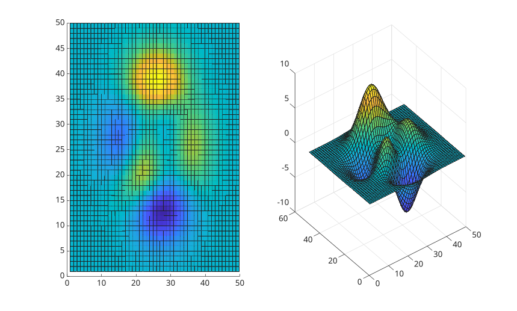

# surface

Primitive surface plot.

## 📝 Syntax

- surface(X, Y, Z)
- surface(X, Y, Z, C)
- surface(Z)
- surface(Z, C)
- surface(parent, ...)
- surface(..., propertyName, propertyValue)
- go = surface(...)

## 📥 Input argument

- X - x-coordinates: vector or matrix.
- Y - y-coordinates: vector or matrix.
- Z - z-coordinates: vector or matrix.
- C - Color array: m-by-n-by-3 array of RGB triplets.
- parent - a scalar graphics object value: parent container, specified as a axes.
- propertyName - a scalar string or row vector character.
- propertyValue - a value.

## 📤 Output argument

- go - a graphics object: surface type.

## 📄 Description


<b>surf</b> and<b>surface</b> functions are both used to create 3D surface plots, but there are some slight differences between the two. 

<b>surf</b> function is used to plot a surface defined by a function of two variables, or by a set of scattered data points. 

It requires three input arguments: X, Y, and Z. X and Y define the coordinates of the data points, and Z defines the height of the surface at each point. 

<b>surf</b> function also applies high-level plot setup such as axes replacement, 3D view, and grid defaults. 

 

<b>surface</b> function creates a primitive surface object in the current or specified axes. 

The size of Z must match the size of X and Y. The surface function also provides additional options for customizing the appearance of the plot, such as lighting and color. 

In summary, both <b>surf</b> and<b>surface</b> functions are used for 3D surface plots but<b>surf</b> is used for a surface defined by a function of two variables or by a set of scattered data points, while <b>surface</b> is used for a surface defined by a matrix of data, and the size of Z must match the size of X and Y. 

See [surface properties](../../../graphics/2_graphics_objects/4_properties/nelson.graphics.surface.properties.md) for the complete property list.

## 💡 Example


```matlab
f = figure();
data = peaks(50);
ax1 = subplot(1, 2, 1);
s1 = surface(ax1, data);
ax2 = subplot(1, 2, 2);
s2 = surf(ax2, data);

```



## 🔗 See also

[surface properties](../../../graphics/2_graphics_objects/4_properties/nelson.graphics.surface.properties.md), [surf](../../../graphics/1_plots/7_surfaces_volumes_polygons/surf.md), [view](../../../graphics/3_labels_styling/3_interactions_camera_lighting/view.md), [light](../../../graphics/3_labels_styling/3_interactions_camera_lighting/light.md), [shading](../../../graphics/3_labels_styling/2_color_styling/shading.md), [meshgrid](../../../elementary_functions/1_array_creation_shape/meshgrid.md).

## 🕔 History

| Version | 📄 Description     |
| ------- | --------------- |
| 1.0.0   | initial version |

<!--
## 👤 Author

Allan CORNET
-->
