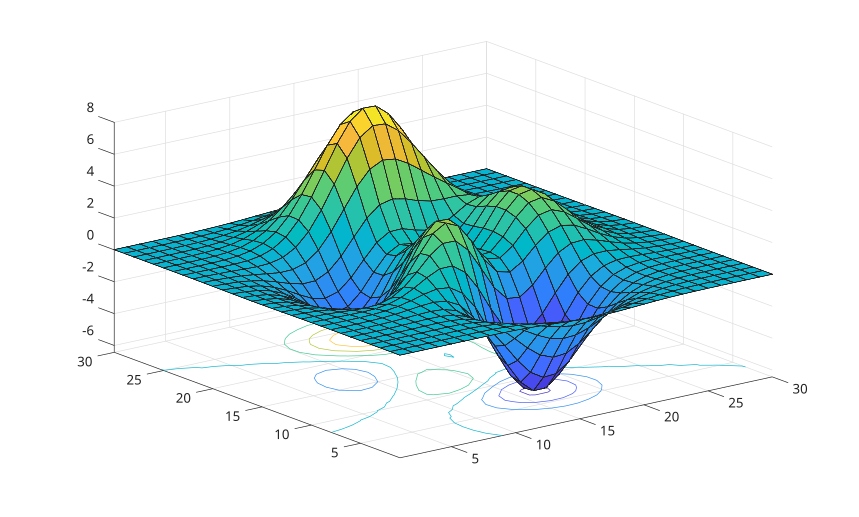

# surfc

Display a surface with contour lines below it.

## 📝 Syntax

- surfc(Z)
- surfc(X, Y, Z)
- surfc(parent, ...)
- h = surfc(...)

## 📄 Description

<b>surfc</b> displays a surface and contour lines projected at the base of the surface.

## 💡 Example

Surface with contours.

```matlab
surfc(peaks(30));
```



## 🔗 See also

[surf](../../../graphics/1_plots/7_surfaces_volumes_polygons/surf.md), [contour3](../../../graphics/1_plots/3_contour_plots/contour3.md).
