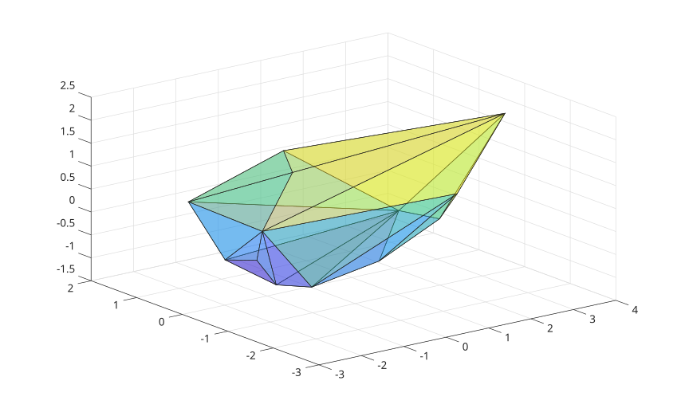

# trisurf

Triangular surface plot

## 📝 Syntax

- trisurf(T, x, y, z)
- trisurf(TO)
- trisurf(..., c)
- trisurf(..., Name, Value)
- h = trisurf(...)

## 📄 Description


<b>trisurf</b> plots a 3-D triangular surface from a triangle connectivity matrix or a triangulation object.

## 💡 Examples

Plot the convex hull facets of random 3-D points.

```matlab
P = randn(30, 3);
T = convhulln(P);
trisurf(T, P(:, 1), P(:, 2), P(:, 3), 'FaceAlpha', 0.4)
```


```matlab

N = 5e3;
g = randn(3,N);
p = g./vecnorm(g);
k = convhull(p');
c = @(x) sparse(k(:,x)*[1,1,1],k,1,N,N);
t = c(1) | c(2) | c(3);
w = spdiags(-sum(t,2)+1, 0, double(t));
Y = rand(N,1);
A = speye(N);
smoothness  = 10;
x   = (A + smoothness *w' * w) \ Y;
p2 = p .* x';
trisurf(k,p2(1,:),p2(2,:),p2(3,:),'FaceC', 'w', 'EdgeC', 'none','AmbientS',0,'DiffuseS',0.6,'SpecularS',1);
light;
axis equal
axis off
```


## 🔗 See also

[patch](../../../graphics/1_plots/7_surfaces_volumes_polygons/patch.md), [surf](../../../graphics/1_plots/7_surfaces_volumes_polygons/surf.md), [triplot](../../../graphics/1_plots/7_surfaces_volumes_polygons/triplot.md), [triangulation](../../../geometry/triangulation.md).

## 🕔 History

| Version | 📄 Description     |
| ------- | --------------- |
| 2.0.0   | Initial version. |

<!--
## 👤 Author

Allan CORNET
-->
