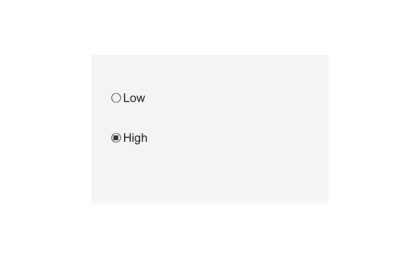

# uibuttongroup

Create button group container.

## 📝 Syntax

- h = uibuttongroup()
- h = uibuttongroup(parent)
- h = uibuttongroup(..., propertyName, propertyValue)

## 📥 Input argument

- parent - parent container (uifigure, figure, uipanel, uitab, uibuttongroup, uigridlayout).
- propertyName, propertyValue - name-value pairs.

## 📤 Output argument

- h - container object.

## 📄 Description

<b>bg = uibuttongroup</b> creates a button group container used to manage exclusive selection of radio buttons and toggle buttons. Main properties: <b>Title</b>, <b>TitlePosition</b>, <b>SelectedObject</b>, <b>Buttons</b> (read-only), <b>SelectionChangedFcn</b> (event data with <b>OldValue</b> and <b>NewValue</b>), plus panel-style border and font properties.

## 💡 Examples

Captured UI component for the help image.

```matlab
f = uifigure('Visible', 'off', 'Name', 'Button group', 'Position', [100 100 420 260]);
bg = uibuttongroup(f, 'Position', [90 55 240 150]);
r1 = uiradiobutton(bg, 'Text', 'Low', 'Position', [20 95 120 22]);
r2 = uiradiobutton(bg, 'Text', 'High', 'Position', [20 55 120 22]);
r2.Value = true;
drawnow();
```


uibuttongroup

```matlab

f = uifigure();
bg = uibuttongroup(f, 'Title', 'Choices', 'Position', [20 20 260 210]);

```

## 🔗 See also

[uifigure](../../../gui/uifigure.md).

## 🕔 History

| Version | 📄 Description  |
| ------- | --------------- |
| 2.0.0   | initial version |

<!--
## 👤 Author

Allan CORNET
-->
