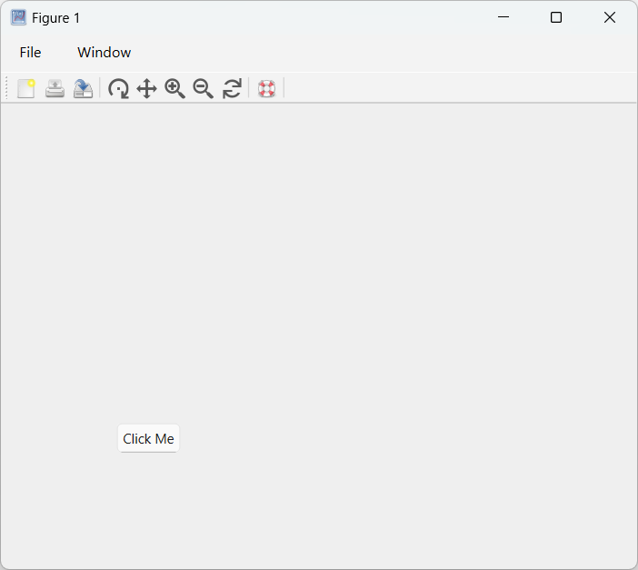
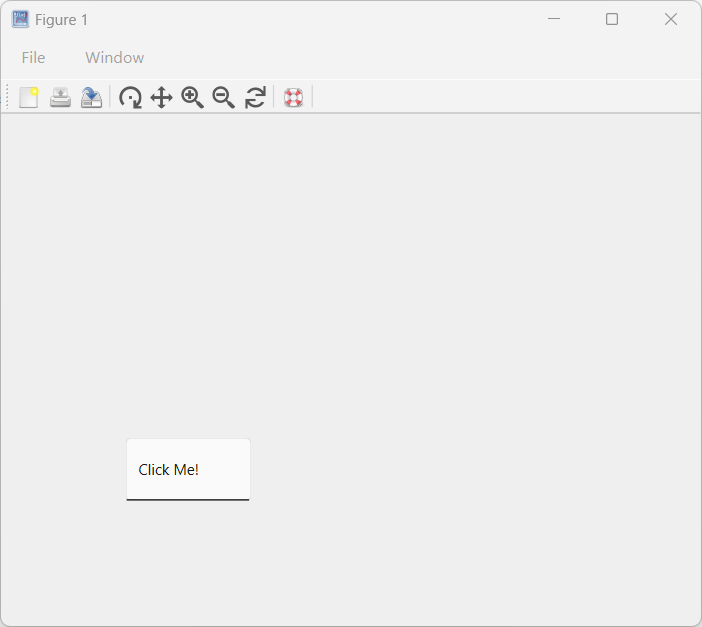
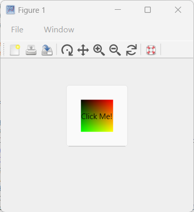
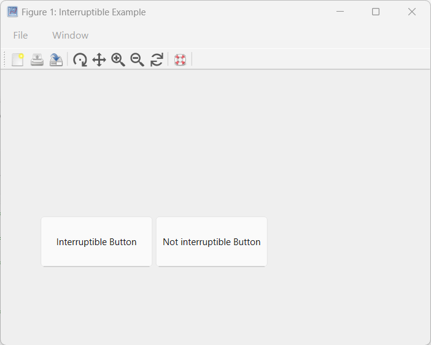

# uicontrol

Create user interface component.

## 📝 Syntax

- c = uicontrol()
- c = uicontrol(propertyName, propertyValue)
- c = uicontrol(parent)
- c = uicontrol(parent, propertyName, propertyValue, ...)
- uicontrol(c)

## 📥 Input argument

- parent - figure graphics object.
- propertyName - property name: a scalar string or row vector character.
- propertyValue - property value: a value compatible with property name.
- c - an User Interface control object.

## 📤 Output argument

- c - an User Interface control object.

## 📄 Description


<b>c = uicontrol</b> creates a push button, which is the default user interface control, within the current figure and returns the associated uicontrol object. If no figure is currently open, Nelson generates one using the figure function. 

<b>c = uicontrol(propertyName, propertyValue)</b> creates a user interface control with properties defined by one or more name-value pair arguments. For instance, specifying 'Style', 'button' will create a button. 

<b>c = uicontrol(parent)</b> creates the default user interface control (push button) within the specified parent container, rather than defaulting to the current figure. 

<b>c = uicontrol(parent, propertyName, propertyValue)</b> creates a user interface control within the specified parent container, allowing you to define its properties using one or more name-value pair arguments. 

<b>uicontrol(c)</b> sets the focus to a previously defined user interface control, bringing it to the forefront for user interaction. 

 

See [uicontrol properties](../../../graphics/2_graphics_objects/4_properties/nelson.graphics.uicontrol.properties.md) for the complete property list.

## 💡 Examples

Pushbutton

```matlab

f = figure;
b = uicontrol(f,Style='pushbutton', String='Click Me', Position=[100 100 60 30], Callback='disp(''Hello World!'')')

```

Checkbox

```matlab

f = figure();
h = uicontrol(Style='checkbox', String='Click Me!', Position=[100, 100, 100, 50]);

```

Edit

```matlab

f = figure();
h = uicontrol(Style='edit', String='Click Me!', Position=[100, 100, 100, 50]);

```

Image

```matlab

hFig = figure(Position=[100, 100, 300, 300]);
imgSize = 50;  % Size of the image
[X, Y] = meshgrid(1:imgSize, 1:imgSize);
CData = cat(3, X/imgSize, Y/imgSize, zeros(imgSize));
CData = im2double(CData);  % Ensure the image is of type double
hButton = uicontrol(Style='pushbutton',  Position=[100, 100, 100, 100], CData=CData, String='Click Me!');

```

uicontrol demo

```matlab

addpath([modulepath('graphics','root'), '/examples/uicontrol'])
edit uicontrol_demo
uicontrol_demo

```

uicontrol demo Interruptible

```matlab

addpath([modulepath('graphics','root'), '/examples/uicontrol'])
edit uicontrol_demo_interruptible
uicontrol_demo_interruptible

```



## 🔗 See also

[uicontrol properties](../../../graphics/2_graphics_objects/4_properties/nelson.graphics.uicontrol.properties.md), [figure](../../../graphics/2_graphics_objects/1_object_management/figure.md), [Managing Callback Interruptions in Nelson](../../../graphics/3_labels_styling/3_interactions_camera_lighting/graphical_callback.md).

## 🕔 History

| Version | 📄 Description     |
| ------- | --------------- |
| 1.7.0   | initial version |
| 1.14.0   | Units property added |

<!--
## 👤 Author

Allan CORNET
-->
